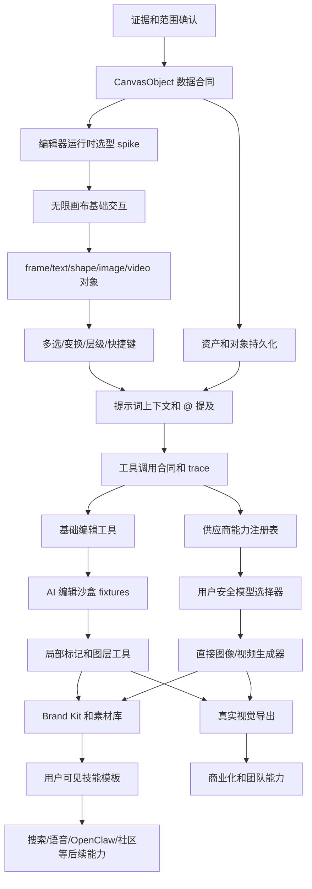

# zenari.ai 对齐 Lovart 的差距补齐蓝图

日期：2026-06-21  
语言：中文  
目标文件：`Docs/20260621_lovart_gap_blueprint.md`  
适用范围：在不破坏 Stage 0 Rev2 已有合同、测试、安全和导出门槛的前提下，把 zenari.ai 从当前本地 alpha 工作区推进到接近 Lovart 的 AI 设计工作区。

## 0. 结论

当前目标不是压缩成 MVP，也不是只找一个所谓“核心差距”。本蓝图按 Lovart 直接 gap 做全面补齐：真实无限画布、可选择和可编辑的画布对象、从选中对象发起的 AI 工具调用、多模型创意生成、品牌和素材上下文、可交付视觉资产导出、Stripe/plan/team 商业化链路、以及对应的安全、配额、追踪和验收证据。

执行原则：

1. 全面覆盖 Lovart 直接 gap，不因总工作量大而删减能力面。
2. 工作量不是收敛理由；唯一硬约束是每个 checklist item 必须能拆到 `<= 2000 LOC` 的可审、可测、可回滚工作量。
3. 画布、工具调用、供应商、编辑、品牌素材、技能、导出、Stripe/plan/team、验证和回滚按 DAG 依赖并行推进。
4. 沙盒 fixture、真实供应商、Stripe 测试模式、真实支付模式可以共用合同分层验收，不把任何一条主线永久降级成“以后再说”。
5. 每条主线都必须有技术栈、路径、实现点、验证命令、验收证据和失败处理。

本蓝图是执行蓝图，不替代 `Docs/stage0_blueprint_rev2.md` 的 Stage 0 上线标准。所有实现必须继续通过 Stage 0 的安全、租户隔离、CSRF、导出资格、QA、可观测性、quota 和审计要求。

## 1. 证据边界

Lovart 侧证据来自 2026-06-21 的公开页面、官方文档、Playwright 可见文本、HTML/RSC 抽取文本和本地 CDP 导航记录。已有证据位于：

- `tmp/lovart-research/playwright-summary.json`
- `tmp/lovart-research/cdp-evidence.json`
- `tmp/lovart-research/extracted/*.txt`
- `tmp/lovart-research/curl-text/*.txt`
- `tmp/lovart-research/pages/*.png`

zenari.ai 侧证据来自：

- `README.md`
- `Docs/stage0_blueprint_rev2.md`
- `openapi/zenart.v1.yaml`（当前仓库兼容性 API 合同路径，公开品牌为 `zenari.ai`）
- `web/components/workspace-app.tsx`
- `web/lib/dev-state.ts`
- `backend/internal/**`
- `scripts/**`
- Stripe sandbox 已通过 CLI 拉通：`STRIPE_MODE=test`、`CHECKOUT_PROVIDER=stripe`、`STRIPE_SANDBOX_PRODUCT_ID`、`STRIPE_DEFAULT_PRICE_ID`、`STRIPE_WEBHOOK_SECRET` 均在本地 `.env` 中配置；`.env.example` 仅提供占位符。

若 Lovart 某个交互在文档里不清楚，执行前要用 CDP 和 Playwright 做 1:1 行为采样：记录可见控件、交互顺序、输入输出状态、键盘快捷键、面板状态和画布对象变化。采样只抽象成交互合同和验收用例，不复制 Lovart 的品牌、文案、图像素材、商业包装或私有实现。

## 2. Lovart 目标态摘要

Lovart 类目标不是“四张候选卡片”，而是一个 AI 设计代理工作区：

- 用户用自然语言、参考文件、品牌资料、画布对象、素材库和 Web Search 发起任务。
- 系统可自动选择工具和模型，也允许用户用模型选择器或 `@` 提及锁定模型、素材、Brand Kit、画布对象。
- 输出落在无限画布上，可选中、移动、缩放、裁切、分层、编辑、批量导出。
- 用户可从画布对象继续 AI 编辑，包括去背景、放大、擦除、扩图、局部标记编辑、元素拆分、文字编辑、视角变化、移动对象、矢量化和 mockup。
- 用户可跳过代理，直接打开图像或视频生成器，设置模型参数。
- Brand Kit 保存 logo、色彩、字体、设计指导和品牌手册解析结果，并可作用于项目或单次生成。
- Assets Library 保存跨项目复用的角色、图片、音频、视频和参考素材。
- Skills 提供一键工作流、缺失信息收集、多步骤链路和从成功对话沉淀的自定义工作流。
- 导出面向真实交付文件，而不是只导出元数据说明。

## 3. zenari.ai 当前已完成能力

zenari.ai 已具备 Stage 0 本地 alpha 的强工程底座：

- Web 用户端、Admin、Go backend、worker、crawler、OpenAPI 合同和迁移框架。
- Chatbox 到 4 个候选，再选 1 个方向继续迭代的基础工作流。
- 参考上传、候选卡片、候选选择、画布节点渲染、autosave、版本恢复、package、export、billing/quota、support。
- API 合同覆盖 workspace、chat、tasks、candidates、canvas nodes、frames、versions、uploads、packages、exports、quota、provider status、usage、traces、safety、eval、audit。
- `web/components/workspace-app.tsx` 已有完整产品壳，但画布是 bounded DOM node surface，不是 Lovart 类直接操作编辑器。
- 供应商、quota、trace、QA、安全和导出门槛已有合同基础，但用户侧尚未暴露多模型创意控制。
- billing/quota 抽象已经存在；Stripe CLI 已用 `zenari.ai` 沙盒 test key 验证 `livemode=false`，并创建了 sandbox product/price。后续关键验收点是 checkout、webhook 幂等、订阅状态、退款/credit、provider usage 和 quota ledger 一致。

当前缺口不是单点缺口，而是 Lovart 类完整设计工作区全链路：画布、对象、编辑、生成、供应商、品牌素材、技能、搜索、导出、支付、团队、配额、安全和证据闭环都需要进入同一张执行图。

## 4. 直接差距和技术栈映射

| Lovart 直接能力 | zenari.ai 当前状态 | 推荐技术栈 | 落地原则 |
| --- | --- | --- | --- |
| 应用品牌升级 | 公开品牌已迁到 `zenari.ai`，部分内部路径和数据标识仍沿用小写兼容性标识 | `APP_BRAND_NAME`、`APP_PUBLIC_DOMAIN`、`NEXT_PUBLIC_APP_BRAND_NAME`、`NEXT_PUBLIC_APP_DOMAIN`、品牌迁移检查脚本 | 公开品牌统一为 `zenari.ai`；代码包名、兼容性文件路径和数据表迁移按兼容计划推进 |
| 无限画布 pan/zoom/select/drag/frame | 静态 bounded DOM 节点 | `tldraw` 作为首选编辑器运行时；React 19；TypeScript；自定义 shape adapter | 先做 2 天 spike 验证许可证、SSR 边界、custom shape、200 对象性能；失败则退到 `react-konva` + 自研 store |
| 图像、视频、文本、形状、frame、vector、generated layer | OpenAPI 有 node/frame/version，但 UI 类型不足 | OpenAPI 3.1 + TS 类型 + Go struct；必要时加 `web/lib/canvas/*` adapter | 先定义 `CanvasObject`，再接编辑器，不让 UI state 成为唯一真实数据 |
| 多选、变换、z-index、锁定、隐藏、分组 | 未实现 | 编辑器 store + reducer 单测 + Playwright | 对象操作必须可测试、可持久化、可导出 |
| 从选中对象进入提示词上下文 | 只有候选选择和迭代表单 | React prompt composer；mention parser；typed prompt payload | selected object chips、`@object`、`@brand`、`@asset`、`@model` 都进入 trace |
| 自动模型和显式模型选择 | dev provider，用户侧隐藏 routing | 后端 provider capability registry；用户安全模型选择器 | UI 只能显示可用模型和参数，不能泄露 key、隐藏提示词或不可用模型 |
| 直接图像生成器 | 只有候选生成工作流 | `web/components/generators/image-generator-panel.tsx`；provider request schema | 支持比例、尺寸、reference mode、seed、quality 的能力声明 |
| 直接视频生成器 | 无视频生成 UI | `web/components/generators/video-generator-panel.tsx`；video object shape | 支持比例、时长、首尾帧、参考素材，沙盒和真实供应商共用同一合同 |
| 基础编辑：adjust/crop/flip/rotate | 无 | 客户端 transform metadata；服务端 bake；Canvas API | 非破坏性实现，保存为对象 transform 或新 revision |
| AI 编辑：upscale/remove-bg/eraser/expand | 无 | 沙盒 provider fixtures；真实 provider adapter；object storage | 每次编辑创建新资产，原始资产保留，trace 和 quota 必须完整 |
| 局部标记编辑 | 无 | 编辑器自定义 tool + HTMLCanvas mask overlay；必要时 `react-konva` 只用于 mask 面板 | 采集 point/rect/lasso/brush mask，转成工具调用输入 |
| Edit Elements/layers | 无 | layer manifest schema；自定义 layer panel | deterministic layer fixture 和真实拆层供应商共用同一 layer manifest |
| Edit Text | Canvas text 尚弱，图片中文字无法编辑 | editable text object；OCR/text-edit provider slot | Canvas 文本先原生可编辑，图片内文字走 provider 输出新资产 |
| Multi-Angles/Move Object/Vectorize/Mockup | 无 | 工具 registry + provider slots；SVG export；mockup template manifest | 可回放 fixture 和真实模型 adapter 共用工具合同 |
| Brand Kit | 无专门对象 | `backend/internal/brandkit`；`web/components/brand-kit`; OpenAPI schema | manual kit、PDF/brand book parser、项目级应用和单次提及都进入执行图 |
| Assets Library | workspace reference upload | `backend/internal/assets`; objectstore; reusable asset picker | 租户隔离、跨项目复用、插入画布和提示词 |
| Skills/Quickstart | Admin 隐藏 skill，不给用户暴露 | curated user skill registry；`web/components/skillbook` | 用户只看审核后的技能模板，不暴露 Admin 内部结构 |
| Web Search/visual insights | crawler/admin 隐藏 | server-side search adapter + citation/provenance | 先白名单搜索和引用，不把原始抓取器暴露给用户 |
| 真实视觉导出 | ZIP/metadata/QA 证据强，真实视觉弱 | JSZip 已有；tldraw SVG/PNG export；PPTX 后续 `pptxgenjs`；PSD 先 layer manifest，后续 `ag-psd` | 导出不得把 placeholder 当真实成品 |
| Stripe/plan/team | billing/quota 抽象较完整 | 现有 billing provider interface；Stripe adapter；team/seat/quota schema | 支付、订阅、团队席位、provider cost 和 quota ledger 同步验收，不降级为旁支 |

## 5. 总体技术栈决策

### 5.1 前端

- 保留：Next.js 16、React 19、TypeScript、lucide-react、Vitest、Playwright、JSZip。
- 新增首选：`tldraw`，用于无限画布、选中、拖拽、缩放、frame、shape、text、image、undo/redo 和持久化 adapter。
- 新增条件：如 mask/lasso 工具在 `tldraw` 内实现成本过高，在编辑面板引入 `react-konva` 或原生 Canvas 2D，形成主画布和局部编辑画布的分层架构。
- 状态管理：编辑器自身 store 负责画布对象；跨 prompt、asset panel、brand panel、export panel、billing/quota 的共享状态可以引入小范围 store，必须有 typed adapter 和 reducer 单测。
- 图标继续使用 lucide-react。
- 设计原则：工作区优先，避免营销式 landing；控件密度按生产工具处理。

### 5.2 后端

- 保留：Go API、worker、Postgres、Redis、object storage adapter、billing/quota、provider contracts、trace、QA、安全和审计。
- 新增包建议：
  - `backend/internal/canvas`：对象合同、版本、frame、导出资格投影。
  - `backend/internal/assets`：视觉资产、复用素材、lineage、thumbnail、object storage ref。
  - `backend/internal/brandkit`：品牌资料、品牌手册解析、项目绑定、单次提及绑定。
  - `backend/internal/edittools`：编辑任务合同和工具结果。
  - `backend/internal/provider/adapters`：图像、视频、编辑、3D 可选供应商 adapter。
  - `backend/internal/skillbook`：用户可见技能模板、缺失信息收集和自定义技能 replay。
  - `backend/internal/team`：团队、席位、并发、seat credit 和企业配额。
- 本地非 AI 图像变换可用浏览器 metadata 表示，同时要定义服务端 bake/export worker 的合同，避免导出链路和编辑链路脱节。

### 5.3 数据和合同

- 继续以 `openapi/zenart.v1.yaml` 为当前仓库用户 API 合同兼容性文件名；公开品牌、环境变量和 UI 文案升级为 `zenari.ai`。
- TypeScript 前端类型继续由 OpenAPI 生成或手写同步，不能让组件私有类型脱离 API。
- 每个 provider request/response 必须有 schema、trace、quota reservation、safety decision、QA result、export eligibility。
- 每个视觉资产必须有 `asset_id`、`object_id`、`source_asset_id`、`lineage`、`provider_ref`、`model_ref`、`tool_params`、`storage_ref`、`thumbnail_ref`、`created_by_task_id`。

### 5.4 验证命令基线

每个阶段至少保留以下基线命令：

```bash
cd web && npm run typecheck
cd web && npm run test
cd web && npm run smoke:workspace-rendering-performance
cd backend && go test ./...
python3 scripts/validate_stage0_rev2.py
python3 scripts/validate_trace_completeness.py
python3 scripts/validate_export_eligibility_decision_contract.py
python3 scripts/validate_safety_enforcement_contract.py
bash scripts/repo_validate.sh
bash scripts/stripe_sandbox_selftest.sh
```

新增 Playwright 用例后，按功能追加：

```bash
cd web && npx playwright test tests/lovart-canvas.spec.ts
cd web && npx playwright test tests/lovart-edit-tools.spec.ts
cd web && npx playwright test tests/lovart-brand-assets.spec.ts
cd web && npx playwright test tests/lovart-export.spec.ts
```

## 6. DAG 结构



无环规则：任何执行项只能依赖上游已验收项或已有 Stage 0 能力。发现循环依赖时，必须拆成只读合同、沙盒 fixture、真实集成三个更小任务。

## 7. 树形执行结构

```text
R. 证据、范围和验收纪律
A. 画布数据合同
B. 无限画布运行时
C. 资产、版本和持久化
D. 提示词上下文和工具调用
E. 供应商能力和直接生成器
F. 编辑工具
G. Brand Kit、素材库和技能模板
H. 导出和交付文件
I. 商业化、团队和配额
J. 验证、观测、风险和回滚
```

所有检查清单行项默认代码规模上限为 `<= 2000 LOC`。如果实现评估超过上限，必须拆成更小行项后再动手。文档、测试、fixture 和迁移也计入工作量估算。

## 8. 检查清单

### R. 证据、范围和验收纪律

| ID | 依赖 | 技术栈和路径 | 落地实现点 | 验收证据 | 验证命令 | 规模 |
| --- | --- | --- | --- | --- | --- | --- |
| R1 | 无 | `Docs/20260621_lovart_gap_blueprint.md` | 确认 Lovart 证据、zenari.ai Done、全量差距、DAG 和任务拆分；支付、团队、配额作为商业化主线纳入同一张执行图 | 本文件存在，且包含目标、差距、技术栈、DAG、树形清单、验收门槛 | `rg -n "Lovart|DAG|技术栈|规模" Docs/20260621_lovart_gap_blueprint.md` | <= 2000 LOC |
| R2 | R1 | `Docs/researches/lovart_interaction_contract_YYYYMMDD.md` | 对不清楚的 Lovart 交互用 CDP/Playwright 采样，记录控件、状态、输入输出、快捷键和画布对象变化 | 交互合同可复现，不含私有账号、cookie、品牌素材和非公开文案 | `rg -n "cookie|session|secret|token" Docs/researches || true` | <= 2000 LOC |
| R3 | R1 | `Docs/stage0_blueprint_rev2.md`, `scripts/*` | 建立 Stage 0 回归清单，列出每个新阶段必须保留的现有验证命令 | 每个阶段都引用 Stage 0 回归命令，不允许绕过安全和导出门槛 | `python3 scripts/validate_stage0_rev2.py` | <= 2000 LOC |
| R4 | R1 | `Docs/20260621_lovart_gap_blueprint.md` | 明确总验收规则：执行者只能提交候选结果，总验收人依据命令、截图、trace、导出包和 diff 接受 | 文档中有总验收定义和失败处理 | `rg -n "总验收|失败处理|回滚" Docs/20260621_lovart_gap_blueprint.md` | <= 2000 LOC |
| R5 | R1 | `.env`, `.env.example`, `docker-compose.yml`, `web/app/layout.tsx`, `web/components/**`, `web/lib/legal-policies.ts`, `scripts/*` | 应用品牌迁移：公开品牌、浏览器标题、导航文案、legal/support 邮箱、crawler UA、analytics key、cookie/header 命名和环境变量统一到 `zenari.ai`；兼容性包名、OpenAPI 文件名、数据库名和历史证据路径保留兼容说明 | 用户可见页面和运行时 env 显示 `zenari.ai`，小写兼容性标识只出现在明确标注的内部兼容路径 | `python3 scripts/validate_zenari_brand_migration.py web/app web/components web/lib .env.example docker-compose.yml scripts` | <= 2000 LOC |

### A. 画布数据合同

| ID | 依赖 | 技术栈和路径 | 落地实现点 | 验收证据 | 验证命令 | 规模 |
| --- | --- | --- | --- | --- | --- | --- |
| A1 | R1 | `openapi/zenart.v1.yaml`, `web/lib/contracts.ts`, `backend/internal/canvas` | 定义 `CanvasObject`：`image`、`video`、`text`、`shape`、`frame`、`group`、`vector`、`generated_layer` | OpenAPI、TS、Go 三处字段一致 | `cd web && npm run typecheck`; `cd backend && go test ./...` | <= 2000 LOC |
| A2 | A1 | 同 A1 | 增加 transform 字段：`x`、`y`、`width`、`height`、`rotation`、`zIndex`、`frameId`、`locked`、`hidden` | 单测覆盖序列化、默认值、非法尺寸、非法 frame 引用 | `cd web && npm run test -- canvas`; `cd backend && go test ./internal/canvas/...` | <= 2000 LOC |
| A3 | A1 | `openapi/zenart.v1.yaml` | 定义 `AssetRef`、`SourceRef`、`LineageRef`、`ProviderRef`、`ToolInvocationRef` | 任何画布对象可追溯到资产、任务、工具和来源 | `python3 scripts/validate_trace_completeness.py` | <= 2000 LOC |
| A4 | A1 | `web/lib/canvas/canvas-store.ts` | 写纯函数 reducer：选择、取消选择、多选、移动、缩放、旋转、层级、锁定、隐藏 | reducer 单测覆盖核心编辑操作，不依赖 DOM | `cd web && npm run test -- canvas-store` | <= 2000 LOC |
| A5 | A1 | `backend/migrations/*`, `backend/internal/stage0` | 如需持久化新增字段，添加迁移和向后兼容读取；本地 dev-state 先同步字段 | 老 workspace 数据可读取，新对象可保存和恢复 | `cd backend && go test ./internal/stage0/...` | <= 2000 LOC |
| A6 | A1 | `openapi/zenart.v1.yaml`, `web/lib/generated` | 更新 OpenAPI client 生成结果或手写同步层，避免组件私有字段漂移 | generated client 测试通过，无 TS any 逃逸 | `python3 scripts/generate_openapi_clients.py`; `cd web && npm run typecheck` | <= 2000 LOC |

### B. 无限画布运行时

| ID | 依赖 | 技术栈和路径 | 落地实现点 | 验收证据 | 验证命令 | 规模 |
| --- | --- | --- | --- | --- | --- | --- |
| B1 | A1 | `web/package.json`, `web/components/canvas` | 做 `tldraw` spike：安装、SSR 边界、custom shape、200 对象渲染、license 记录；失败则记录 `react-konva` 退路 | spike 文档和可运行 canvas demo | `cd web && npm run typecheck`; `cd web && npm run smoke:workspace-rendering-performance` | <= 2000 LOC |
| B2 | B1 | `web/components/canvas/editor-shell.tsx` | 用新 editor shell 替换 bounded `canvas-surface` 的内部实现，保留现有页面入口和 smoke test data attributes | 工作区仍可打开，旧 brief/candidate/package/export UI 不回退 | `cd web && npm run test`; `cd web && npm run smoke:workspace-rendering-performance` | <= 2000 LOC |
| B3 | B2 | `web/components/canvas/viewport-controls.tsx` | 实现 pan、zoom、fit、reset、hand tool、滚轮和触控板行为 | Playwright 能缩放、拖动画布、重置视图 | `cd web && npx playwright test tests/lovart-canvas.spec.ts` | <= 2000 LOC |
| B4 | B2 | `web/components/canvas/object-shapes.tsx` | 实现 image、video、text、shape、frame 的渲染和点击选择 | 每种对象可显示、选择、移动，frame 可容纳对象 | `cd web && npm run test -- canvas`; `cd web && npx playwright test tests/lovart-canvas.spec.ts` | <= 2000 LOC |
| B5 | B4 | `web/components/canvas/selection-handles.tsx` | 实现拖拽、resize、rotation、multi-select、delete、duplicate、bring forward/send backward | 选中状态稳定，快捷操作不改变非选中对象 | `cd web && npx playwright test tests/lovart-canvas.spec.ts` | <= 2000 LOC |
| B6 | B4 | `web/components/canvas/toolbar.tsx` | 增加画布工具栏：select、hand、frame、text、shape、upload、undo、redo、zoom | 工具栏使用 lucide 图标和 tooltip，不出现文案挤压 | `cd web && npm run typecheck`; Playwright 截图验收 | <= 2000 LOC |
| B7 | B5 | `web/components/canvas/keyboard.ts` | 快捷键：delete、duplicate、undo、redo、zoom、space hand、shift multi-select | 快捷键测试通过，不拦截输入框文本输入 | `cd web && npm run test -- keyboard`; `cd web && npx playwright test tests/lovart-canvas.spec.ts` | <= 2000 LOC |
| B8 | B5 | `web/components/canvas/layers-panel.tsx` | Layers panel：显示对象、frame、隐藏、锁定、重命名、层级调整 | layer panel 操作和画布状态同步 | `cd web && npm run test -- layers`; Playwright 用例 | <= 2000 LOC |

### C. 资产、版本和持久化

| ID | 依赖 | 技术栈和路径 | 落地实现点 | 验收证据 | 验证命令 | 规模 |
| --- | --- | --- | --- | --- | --- | --- |
| C1 | A3 | `backend/internal/assets`, `openapi/zenart.v1.yaml` | 定义 `VisualAsset`：image、video、audio、font、svg、pdf、pptx、psd_manifest | API 可返回 asset metadata 和 thumbnail | `cd backend && go test ./internal/assets/...` | <= 2000 LOC |
| C2 | C1 | `backend/internal/objectstore`, `web/lib/dev-state.ts` | 把 dev fixture 资产写成真实 `storage_ref` 或本地 adapter ref，不再只靠说明文本 | package/export 能拿到实际文件 ref 或确定性 fixture 文件 | `cd backend && go test ./internal/objectstore/...`; `cd web && npm run test -- dev-state` | <= 2000 LOC |
| C3 | C1 | `backend/internal/assets/lineage.go` | 实现资产 lineage：original、derived_from、tool、provider、task、created_at | 编辑后新资产保留原图关系 | `cd backend && go test ./internal/assets/...` | <= 2000 LOC |
| C4 | B4, C1 | `web/components/canvas/asset-loader.tsx` | 画布对象从 asset ref 加载 image/video thumbnail，失败时显示可恢复错误态 | 资产加载失败不破坏画布，用户能重试 | `cd web && npm run test -- asset-loader` | <= 2000 LOC |
| C5 | B5, C3 | `web/components/canvas/version-history.tsx` | 版本历史从 workspace 级扩展到对象级 revision 预览 | 可恢复对象 revision，恢复不丢失其他对象 | `cd web && npx playwright test tests/lovart-canvas.spec.ts` | <= 2000 LOC |
| C6 | C1 | `backend/internal/assets/tenant_test.go` | 资产和素材跨租户隔离测试，禁止通过 asset id 读取其他租户文件 | 后端测试证明隔离 | `cd backend && go test ./internal/assets/... ./internal/stage0/...` | <= 2000 LOC |

### D. 提示词上下文和工具调用

| ID | 依赖 | 技术栈和路径 | 落地实现点 | 验收证据 | 验证命令 | 规模 |
| --- | --- | --- | --- | --- | --- | --- |
| D1 | B5 | `web/components/prompt-composer` | 将现有迭代表单拆成 prompt composer，支持 selected object chips | 选中画布对象后输入框显示对象 chip，取消选择后同步消失 | `cd web && npm run test -- prompt`; Playwright 用例 | <= 2000 LOC |
| D2 | D1 | `web/lib/mentions` | 实现 `@object`、`@asset`、`@brand`、`@model`、`@skill` mention parser 和 picker | parser 单测覆盖中文、空格、重复 mention、删除 mention | `cd web && npm run test -- mentions` | <= 2000 LOC |
| D3 | D2 | `openapi/zenart.v1.yaml`, `backend/internal/agent` | 定义 `PromptContextPayload`：text、selected_object_ids、asset_ids、brand_kit_ids、model_locks、tool_hint | 后端收到完整上下文并写入 trace | `cd backend && go test ./internal/agent/...`; `python3 scripts/validate_trace_completeness.py` | <= 2000 LOC |
| D4 | D3 | `backend/internal/task`, `backend/internal/billing` | 工具调用前做 quota reservation，成功 commit，失败或取消按策略 refund | 失败不会吞额度，成功有 usage 记录 | `cd backend && go test ./internal/task/... ./internal/billing/...` | <= 2000 LOC |
| D5 | D3 | `backend/internal/security`, `backend/internal/provider` | 工具调用 trace 红线：不把 provider key、隐藏提示词、系统策略返回前端、导出包或 support ticket | redaction 测试覆盖 trace、log、export、support | `cd backend && go test ./internal/security/...`; `python3 scripts/validate_trace_visibility_export_retention.py` | <= 2000 LOC |
| D6 | D3 | `web/components/canvas/tool-status.tsx` | 在画布对象上显示工具运行态：queued、running、succeeded、failed、cancelled、blocked | UI 状态和 task 状态一致，可 retry/cancel | `cd web && npx playwright test tests/lovart-canvas.spec.ts` | <= 2000 LOC |
| D7 | D3 | `schemas/edit-tools` 或 OpenAPI schema | 建工具注册表：generate_image、generate_video、edit_image、remove_background、upscale、expand、erase、move_object、vectorize、mockup、edit_text、split_layers | 每个工具有输入 schema、输出 schema、支持对象类型、禁用原因 | `cd backend && go test ./internal/agent/...`; `cd web && npm run typecheck` | <= 2000 LOC |

### E. 供应商能力和直接生成器

| ID | 依赖 | 技术栈和路径 | 落地实现点 | 验收证据 | 验证命令 | 规模 |
| --- | --- | --- | --- | --- | --- | --- |
| E1 | D7 | `backend/internal/provider/capabilities.go` | 定义能力注册表：image_generation、image_edit、video_generation、image_to_video、upscale、remove_bg、vectorize、3d_optional | 能力矩阵可被前端和 Admin 查询 | `cd backend && go test ./internal/provider/...` | <= 2000 LOC |
| E2 | E1 | `backend/internal/provider/adapters/sandbox` | 沙盒 adapter 输出确定性 image/video/edit fixture，用于无 key 环境 | 本地测试可生成真实 fixture 文件和 thumbnail | `cd backend && go test ./internal/provider/... ./internal/worker/...` | <= 2000 LOC |
| E3 | E1 | `web/components/model-picker` | 用户安全模型选择器：Auto、图片偏好、视频偏好、编辑偏好、严格 `@model` 锁定 | UI 只展示能力矩阵允许的模型和参数 | `cd web && npm run test -- model-picker`; Playwright 用例 | <= 2000 LOC |
| E4 | E3 | `backend/internal/provider` | 后端校验 model lock，不允许前端传入未授权 provider/model | 非法 model 请求被拒绝并记录原因 | `cd backend && go test ./internal/provider/...` | <= 2000 LOC |
| E5 | E2, E3 | `web/components/generators/image-generator-panel.tsx` | 直接图像生成器：prompt、reference、aspect ratio、resolution、style/quality、model、seed 可选 | 生成结果自动落画布并带 trace | `cd web && npx playwright test tests/lovart-generators.spec.ts` | <= 2000 LOC |
| E6 | E2, E3 | `web/components/generators/video-generator-panel.tsx` | 直接视频生成器：prompt、start frame、end frame、duration、aspect ratio、resolution、model | 生成 video object，可预览、选中、加入导出 | `cd web && npx playwright test tests/lovart-generators.spec.ts` | <= 2000 LOC |
| E7 | E1 | `backend/internal/provider/adapters/*` | 真实供应商 adapter 分批接入：先一个 image generation，一个 image edit，一个 video generation；每个 adapter 有 sandbox test | 无 key 时测试用 sandbox，有 key 时 staging 验证真实调用 | `cd backend && go test ./internal/provider/...`; `python3 scripts/validate_safety_enforcement_contract.py` | <= 2000 LOC |
| E8 | E7 | `backend/internal/billing`, `backend/internal/provider` | 供应商 usage、cost、quota reconciliation、retry、超时、并发限制和 kill switch | 无静默 fallback，账务和 trace 可对齐 | `cd backend && go test ./internal/billing/... ./internal/provider/...` | <= 2000 LOC |

### F. 编辑工具

| ID | 依赖 | 技术栈和路径 | 落地实现点 | 验收证据 | 验证命令 | 规模 |
| --- | --- | --- | --- | --- | --- | --- |
| F1 | B5, C3 | `web/components/edit-tools/basic-toolbar.tsx` | 基础编辑 toolbar：crop、flip、rotate、adjust；第一阶段保存 transform metadata | 原图保留，新 revision 或 transform 可恢复 | `cd web && npm run test -- edit-tools`; Playwright 用例 | <= 2000 LOC |
| F2 | F1 | `web/components/edit-tools/crop-panel.tsx` | Crop 面板支持 aspect lock、free crop、apply、cancel、reset | crop 不改变原始 asset，导出能读取 crop metadata | `cd web && npx playwright test tests/lovart-edit-tools.spec.ts` | <= 2000 LOC |
| F3 | F1 | `web/components/edit-tools/adjust-panel.tsx` | Adjust 面板支持 brightness、contrast、saturation、temperature 的 metadata 预览 | 预览、取消、应用状态一致 | `cd web && npm run test -- adjust-panel` | <= 2000 LOC |
| F4 | D7, E2 | `backend/internal/edittools/upscale.go` | Upscale 工具：2K/4K/8K 参数校验，sandbox fixture 和真实 provider adapter 共用 request/response 合同 | 输出新 asset，trace 写入 scale 参数 | `cd backend && go test ./internal/edittools/... ./internal/provider/...` | <= 2000 LOC |
| F5 | D7, E2 | `backend/internal/edittools/remove_bg.go` | Remove background 工具：输入 image asset，输出透明 PNG 或 mask manifest | 输出 asset 可预览、可导出、原图保留 | `cd backend && go test ./internal/edittools/...` | <= 2000 LOC |
| F6 | D7, E2 | `web/components/edit-tools/mask-editor.tsx` | Eraser/inpaint/expand 的 mask 编辑器：point、rect、brush、lasso；保存 mask ref | mask 可复现，不依赖截图坐标 | `cd web && npx playwright test tests/lovart-edit-tools.spec.ts` | <= 2000 LOC |
| F7 | F6 | `backend/internal/edittools/inpaint.go` | Eraser/inpaint：使用 mask + prompt 输出新 asset | trace 包含 mask、prompt、provider、QA | `cd backend && go test ./internal/edittools/...`; `python3 scripts/validate_trace_completeness.py` | <= 2000 LOC |
| F8 | F6 | `backend/internal/edittools/expand.go` | Expand/outpaint：画布扩边、方向、比例、prompt 参数 | 输出尺寸和 frame 对齐，原图保留 | `cd backend && go test ./internal/edittools/...` | <= 2000 LOC |
| F9 | D7, E2 | `backend/internal/edittools/layers.go`, `web/components/edit-tools/layers-editor.tsx` | Edit Elements：先用 deterministic layer fixture 拆出 layer manifest，UI 可隐藏、移动、flatten | layer manifest 可导出，可回滚 | `cd web && npx playwright test tests/lovart-edit-tools.spec.ts`; `cd backend && go test ./internal/edittools/...` | <= 2000 LOC |
| F10 | F9 | `web/components/edit-tools/text-edit.tsx` | Edit Text：Canvas text object 原生编辑；图片内文字走 provider slot 输出新图 | 文本编辑不会丢字体、位置、trace | `cd web && npm run test -- text-edit`; Playwright 用例 | <= 2000 LOC |
| F11 | D7, E2 | `backend/internal/edittools/transforms.go` | Multi-Angles、Move Object、Vectorize、Mockup 作为独立工具 schema 和 sandbox fixture | 每类工具至少有一个可回放 fixture 和禁用原因 | `cd backend && go test ./internal/edittools/...` | <= 2000 LOC |
| F12 | F4-F11 | `web/components/edit-tools/tool-availability.tsx` | 不可用工具显示禁用态和原因：无供应商、对象类型不支持、quota 不足、安全阻断 | 不出现死按钮或假成功 | `cd web && npm run test -- tool-availability` | <= 2000 LOC |

### G. Brand Kit、素材库和技能模板

| ID | 依赖 | 技术栈和路径 | 落地实现点 | 验收证据 | 验证命令 | 规模 |
| --- | --- | --- | --- | --- | --- | --- |
| G1 | D3 | `backend/internal/brandkit`, `openapi/zenart.v1.yaml` | Brand Kit 模型：logo assets、colors、fonts、guidelines、source refs、project binding | CRUD 和租户隔离测试通过 | `cd backend && go test ./internal/brandkit/...` | <= 2000 LOC |
| G2 | G1 | `web/components/brand-kit` | Brand Kit UI：创建、编辑、项目选择、单次提及、颜色和字体预览 | prompt composer 能插入 Brand Kit mention | `cd web && npx playwright test tests/lovart-brand-assets.spec.ts` | <= 2000 LOC |
| G3 | G1 | `backend/internal/brandkit/parser.go` | 品牌手册解析：支持 PDF/图片上传、异步解析状态、颜色/字体/logo/guideline 候选提取和人工确认 | 未解析、解析中、解析失败、解析成功状态可区分，不假装已解析 | `cd backend && go test ./internal/brandkit/...` | <= 2000 LOC |
| G4 | C1 | `backend/internal/assets/library.go` | Assets Library：跨项目复用 image/video/audio/character reference，带 tags 和 usage count | 素材可插入画布和 prompt，跨租户隔离 | `cd backend && go test ./internal/assets/...` | <= 2000 LOC |
| G5 | G4 | `web/components/asset-library` | 素材库 UI：上传、筛选、预览、插入画布、插入 prompt、加入 package | Playwright 完整覆盖素材插入 | `cd web && npx playwright test tests/lovart-brand-assets.spec.ts` | <= 2000 LOC |
| G6 | D7 | `backend/internal/skillbook`, `web/components/skillbook` | 用户可见技能模板：只暴露审核后的 title、input slots、steps summary、expected outputs | 不泄露 Admin 内部 prompt、评审字段和隐藏策略 | `cd backend && go test ./internal/skillbook/...`; `cd web && npm run typecheck` | <= 2000 LOC |
| G7 | G6 | `web/components/skillbook/missing-info.tsx` | 技能运行前缺失信息收集：必填槽、可选槽、参考素材、Brand Kit、输出格式 | 技能不会在必填缺失时启动 | `cd web && npx playwright test tests/lovart-skillbook.spec.ts` | <= 2000 LOC |
| G8 | G6 | `backend/internal/skillbook/replay.go` | 从成功对话生成自定义技能：用户确认、ownership、safety、版本化、撤回 | replay 只在同租户和授权用户可用 | `cd backend && go test ./internal/skillbook/...` | <= 2000 LOC |
| G9 | D3 | `backend/internal/search` | Web Search/visual insights：白名单搜索、引用、摘要、redaction，先不开放任意抓取器 | trace 含引用和时间，不含敏感 token | `cd backend && go test ./internal/search/... ./internal/security/...` | <= 2000 LOC |

### H. 导出和交付文件

| ID | 依赖 | 技术栈和路径 | 落地实现点 | 验收证据 | 验证命令 | 规模 |
| --- | --- | --- | --- | --- | --- | --- |
| H1 | C1, B4 | `web/components/export`, `web/lib/export-download.ts` | 导出预览显示真实 thumbnail、video preview、object lineage、provider/model、QA、安全和阻断原因 | placeholder 不会被标记为真实成品 | `cd web && npm run test -- export`; `python3 scripts/validate_export_eligibility_decision_contract.py` | <= 2000 LOC |
| H2 | B4, C2 | `web/lib/export-image.ts` | frame 或 selection 导出 PNG/JPEG：使用编辑器 export 或 browser canvas，保留 metadata manifest | 导出的图片尺寸、frame、对象数量正确 | `cd web && npx playwright test tests/lovart-export.spec.ts` | <= 2000 LOC |
| H3 | B4, C2 | `web/lib/export-svg.ts` | text/shape/vector/frame 可导出 SVG；raster asset 以引用或嵌入策略处理 | SVG manifest 清楚标明嵌入策略 | `cd web && npm run test -- export-svg` | <= 2000 LOC |
| H4 | B4, C3 | `backend/internal/export/layer_manifest.go` | PSD 第一阶段输出 layered JSON manifest，不承诺完整 PSD writer | manifest 可表达 frame、layer、asset、zIndex、blend、text | `cd backend && go test ./internal/export/...` | <= 2000 LOC |
| H5 | H4 | `backend/internal/export/psd.go` 或独立 export worker | 完整 PSD writer：确定 Go/Node worker 边界；若采用 `ag-psd`，输出 layer、text、raster、frame、manifest 对齐的 PSD | 完整 PSD writer 验证通过后开放下载，失败时回退到 layered manifest 且清楚标注 | `cd backend && go test ./internal/export/...` 或 worker 测试 | <= 2000 LOC |
| H6 | B4 | `web/lib/export-pptx.ts` | PPTX/PDF：把 frame 映射成 slides，文本可编辑优先；采用 `pptxgenjs` 或等价库，保留 manifest 和导出资格门槛 | slide frame 存在时可导出 PPTX/PDF，文本层尽量可编辑，失败原因可见 | `cd web && npx playwright test tests/lovart-export.spec.ts` | <= 2000 LOC |
| H7 | E6, C1 | `backend/internal/export/video.go`, `web/components/export/video-preview.tsx` | MP4 导出：video object 可加入 package，导出时复制或打包 object storage 文件 | video export 含 provenance 和 QA | `cd backend && go test ./internal/export/...`; Playwright 用例 | <= 2000 LOC |
| H8 | H1-H7 | `scripts/validate_*export*.py`, `ops/evidence` | 更新导出资格矩阵：无 trace、无 safety、无 QA、无 storage ref、placeholder 均阻断 | fail-closed，不出现假导出 | `python3 scripts/validate_trace_export_gate_matrix.py`; `python3 scripts/validate_workflow_export_zip_evidence_contract.py` | <= 2000 LOC |

### I. 商业化、团队和配额

| ID | 依赖 | 技术栈和路径 | 落地实现点 | 验收证据 | 验证命令 | 规模 |
| --- | --- | --- | --- | --- | --- | --- |
| I1 | E8 | `backend/internal/billing` | 将创意工具的 quota 单价、reservation、commit、refund 接入现有 billing 抽象 | 每种工具都有 cost policy 和失败退款策略 | `cd backend && go test ./internal/billing/... ./internal/provider/...` | <= 2000 LOC |
| I2 | I1 | `backend/internal/billing/stripe_*`, `.env`, `.env.example`, `scripts/stripe_sandbox_selftest.sh` | Stripe adapter：checkout、subscription、past_due、cancel、refund/credit、webhook idempotency、test/live mode 分离；`.env` 放 zenari.ai sandbox key，`.env.example` 放占位符 | 支付状态和 quota entitlement 一致，webhook 可重复投递且幂等；Stripe 沙盒自测默认通过 | `cd backend && go test ./internal/billing/...`; `bash scripts/stripe_sandbox_selftest.sh` | <= 2000 LOC |
| I3 | I1 | `web/components/billing`, `web/components/quota` | 用户 quota UI 显示 credits、并发任务、消耗明细、失败退款、provider usage summary | 用户能理解每次生成和编辑的消耗 | `cd web && npm run test -- billing`; Playwright 用例 | <= 2000 LOC |
| I4 | I2 | `backend/internal/team`, `web/components/team` | 团队 seats、seat credit settings、任务并发限制、成员邀请、角色权限和企业配额 | 团队功能不绕过租户隔离、quota ledger 和 audit | `cd backend && go test ./internal/team/... ./internal/audit/...` | <= 2000 LOC |

### J. 验证、观测、风险和回滚

| ID | 依赖 | 技术栈和路径 | 落地实现点 | 验收证据 | 验证命令 | 规模 |
| --- | --- | --- | --- | --- | --- | --- |
| J1 | B3 | `web/tests/lovart-canvas.spec.ts` | Playwright 覆盖：打开工作区、pan、zoom、select、drag、resize、frame、text、shape、version restore | 截图和断言证明画布不是静态节点展示 | `cd web && npx playwright test tests/lovart-canvas.spec.ts` | <= 2000 LOC |
| J2 | D7, F1-F12 | `web/tests/lovart-edit-tools.spec.ts` | Playwright 覆盖：crop、rotate、remove-bg fixture、mask edit、layer manifest、edit text | 每类编辑至少一个通过样例 | `cd web && npx playwright test tests/lovart-edit-tools.spec.ts` | <= 2000 LOC |
| J3 | E1-E8 | `backend/internal/provider/*_test.go` | provider contract tests：capability、参数校验、secret redaction、timeout、retry、usage、no silent fallback | 无 key 环境全用 sandbox，有 key 环境 staging 单独跑 | `cd backend && go test ./internal/provider/... ./internal/security/...` | <= 2000 LOC |
| J4 | C1-H8 | `scripts/validate_trace_completeness.py`, `scripts/validate_export_eligibility_decision_contract.py` | 扩展 trace/export validators 覆盖 visual asset、lineage、tool params、QA、安全、storage ref | 导出资格必须可机器验证 | `python3 scripts/validate_trace_completeness.py`; `python3 scripts/validate_export_eligibility_decision_contract.py` | <= 2000 LOC |
| J5 | B3-H8 | `web/scripts` 或 `scripts` | 性能烟测：200 objects pan/zoom/drag p95 <= 100ms；导出预览不阻塞主线程 | 性能报告进入 evidence bundle | `cd web && npm run smoke:workspace-rendering-performance` | <= 2000 LOC |
| J6 | D5, E8, H8 | `backend/internal/security`, `scripts/security_scan_smoke.sh` | 安全扫描：provider key、hidden prompt、cookie、token 不进前端、log、trace、export、support | security smoke 通过 | `bash scripts/security_scan_smoke.sh`; `cd backend && go test ./internal/security/...` | <= 2000 LOC |
| J7 | A1-H8 | `Docs/release_checklists/lovart_gap_beta.md` | 建私测验收清单：创意闭环、编辑、导出、quota、安全、回滚、支持 | 发布前每项有命令、截图、trace 或导出包证据 | `bash scripts/release_evidence_bundle_smoke.sh` | <= 2000 LOC |
| J8 | B2-H8 | `Docs/rollback/lovart_gap_rollback.md` | 回滚策略：新画布 feature flag、provider kill switch、export eligibility fail-closed、迁移回滚 | 出问题可禁用新能力并保留 Stage 0 工作区 | `bash scripts/production_backup_rollback_split_smoke.sh` | <= 2000 LOC |
| J9 | A1-H8 | `ops/evidence/local_alpha` | 紧凑证据包：每个阶段保留命令输出摘要、关键截图、trace id、导出包 manifest、失败原因 | 不保存原始私密对话、cookie、provider key | `bash scripts/release_evidence_bundle_smoke.sh` | <= 2000 LOC |

## 9. 阶段门

阶段门不用于删减范围，只用于控制依赖、证据和发布风险。总工作量可以大；每个行项必须保持 `<= 2000 LOC`，并且不能越过上游合同和验收门槛。

### M0：合同和架构可并行开工

必须完成：

- R1-R5
- A1-A6
- C1-C3
- D3-D7
- E1
- I1
- J4

验收定义：

- Lovart 全量 gap 已被映射到合同、路径、验证命令和证据要求。
- CanvasObject、VisualAsset、PromptContextPayload、ToolRegistry、ProviderCapability、Quota/CostPolicy、ExportEligibility 都有稳定 schema。
- Stripe/plan/team 不被排除在执行图之外，商业化链路有独立合同和验证入口；Stripe sandbox env、product、price、webhook secret 和 CLI selftest 是默认验收输入。
- 任何执行线都能在不破坏 Stage 0 的前提下领取小于 2000 LOC 的工作项。

### M1：Lovart 类工作区骨架可用

必须完成：

- B1-B8
- C4-C6
- D1-D2
- E2-E4
- F1-F3
- H1-H2
- J1
- J3
- J5-J6

验收定义：

- 用户能在真实无限画布上 pan、zoom、select、drag、resize、frame、text、shape、layer、undo、redo。
- 画布对象能加载视觉资产、显示 thumbnail、保存版本、保留 lineage。
- 选中对象、mention、模型锁、quota reservation、trace 和安全 redaction 贯通。
- 沙盒供应商能生成确定性视觉资产，并能被导出为真实文件或可验证 fixture。
- Stage 0 的 brief、candidate、package、export、安全、租户隔离、CSRF、quota 测试继续通过。

### M2：Lovart 直接编辑和生成能力完整覆盖

必须完成：

- E5-E8
- F4-F12
- H3-H8
- J2

验收定义：

- 直接图像生成器和直接视频生成器可用，支持能力矩阵声明的参数。
- Upscale、remove background、eraser/inpaint、expand、mask、layers、edit text、multi-angle、move object、vectorize、mockup 均有可回放 fixture 或真实 provider adapter。
- PNG/JPEG/SVG/PSD/PPTX/PDF/MP4 的导出策略明确，能导出的格式必须包含真实文件、manifest、lineage、QA、安全和 trace。
- 不可用模型、不可用工具、quota 不足、安全阻断和 provider 失败都以机器可读原因展示，不出现假成功。

### M3：品牌、素材、技能、搜索和商业化完整闭环

必须完成：

- G1-G9
- I2-I4
- J7-J9

验收定义：

- Brand Kit 支持手工录入、上传、解析状态、项目级应用和单次提及应用。
- Assets Library 支持跨项目复用、插入画布、插入 prompt、加入 package，并通过租户隔离测试。
- 用户可见技能模板支持缺失信息收集、自定义 replay、版本和安全边界。
- Web Search/visual insights 有引用、时间、redaction 和 trace。
- Stripe checkout、subscription、past_due、cancel、refund/credit、webhook idempotency、team seats、seat credit、并发和企业配额通过测试；`bash scripts/stripe_sandbox_selftest.sh` 默认必须通过。
- 发布清单、回滚清单和证据包完整。

### M4：外部扩展和差异化能力

进入条件：

- M0-M3 的安全、导出、quota、provider、Stripe sandbox/live-mode separation、team 和回滚证据均已通过。

执行范围：

- Voice input。
- OpenClaw 或外部代理适配。
- 社区发布、公开 profile、moderation。
- 视频剪辑器。
- 字体生成库。
- 更深的 3D provider 和 mockup workflow。

## 10. 失败处理、恢复条件和回滚

立即停止当前执行项的条件：

- 三次尝试仍没有新增测试、可运行代码、可复现证据或更清楚的失败原因。
- 新实现削弱 Stage 0 安全、租户隔离、CSRF、导出资格、QA 或 audit。
- provider key、隐藏提示词、cookie、session、token 出现在前端、日志、trace、导出包或支持单。
- 画布仍然只是视觉 mock，没有可持久化对象状态和自动化测试。
- 导出把 placeholder、说明文本或缺 trace 的文件标记成真实成品。
- 单个检查清单行项预计超过 2000 LOC 且没有拆分。

允许恢复的条件：

- 新增了能定位失败的验证命令或 fixture。
- 上游依赖已验收。
- 技术方案发生实质变化，例如从整页 canvas 改为编辑器 adapter，或从真实供应商改为 sandbox fixture 先验收。
- 总验收人明确缩小范围或批准新的拆分项。

回滚策略：

- 新画布必须受 feature flag 控制，可退回 Stage 0 workspace shell。
- 新 provider 必须有 kill switch，失败后自动回到 sandbox 或禁用，不静默换供应商。
- 导出资格必须 fail-closed，缺 trace、缺 storage ref、缺 QA、安全阻断时不可下载。
- 数据迁移必须支持向后兼容读取，不能让旧 workspace 失效。
- 新 UI 组件必须保留旧 smoke test 的关键 data attributes，直到替代测试稳定。

## 11. 总验收标准

本蓝图完成的定义不是文档写完，而是证据证明以下全部成立：

- zenari.ai 有真实可交互的无限画布，而不是静态节点展示。
- 画布对象有稳定合同、持久化、版本、lineage 和导出投影。
- 用户可从选中对象发起生成和编辑工具调用。
- 至少一个图像生成路径、一个图像编辑路径和一个导出路径在 sandbox 或真实供应商下闭环。
- 用户安全模型选择器不会暴露不可用模型、provider secret 或隐藏策略。
- Brand Kit 或等价品牌上下文可进入 prompt 和 trace。
- package/export 下载真实视觉文件和 manifest，不把 placeholder 当成成品。
- Stage 0 的上线门槛继续通过。
- 每个完成项都有命令、测试、截图、trace 或导出包证据。
- 每个检查清单行项都保持在 `<= 2000 LOC` 的实现规模内。

## 12. 推荐第一批并行派工

第一批按主线并行开工，目标是全面覆盖 Lovart 直接 gap，而不是压缩范围。每条线先完成合同、fixture、UI 骨架和验证入口，再接真实供应商、真实支付和高级导出。

1. 画布线：A1-A6、B1-B4、J1。交付 `CanvasObject` 合同、编辑器选型、无限画布基础交互、对象渲染和 Playwright 画布烟测。
2. 资产线：C1-C6、H1。交付 `VisualAsset`、storage ref、thumbnail、lineage、版本恢复、租户隔离和导出预览。
3. 提示词和工具线：D1-D7。交付 selected object chips、mention parser、PromptContextPayload、quota reservation、tool registry、trace 和红线测试。
4. 供应商线：E1-E8。交付 capability registry、sandbox adapter、模型选择器、直接图像/视频生成器、真实 provider adapter、usage/cost/quota reconciliation。
5. 编辑线：F1-F12、J2。交付基础编辑、AI 编辑、mask、layers、edit text、multi-angle、move object、vectorize、mockup 和工具可用性原因。
6. 品牌素材技能线：G1-G9。交付 Brand Kit、品牌手册解析、Assets Library、用户可见技能模板、自定义 replay 和 Web Search/visual insights。
7. 导出线：H2-H8。交付 PNG/JPEG、SVG、layer manifest、PSD、PPTX/PDF、MP4 和导出资格矩阵。
8. 商业化线：I1-I4。交付创意工具 quota、Stripe adapter、用户 quota UI、team seats、seat credit、并发和企业配额。
9. 质量和回滚线：J3-J9。交付 provider 合同测试、trace/export validators、性能烟测、安全扫描、私测验收清单、回滚清单和证据包。

并行规则：

- 不同主线可以同时开工，但任何代码合并必须满足本行项依赖和验证命令。
- 真实 provider、Stripe live mode、公开发布、批量删除和导出开放都必须经过对应安全门槛。
- 如果某条主线被阻塞，不能缩小蓝图范围；应补 fixture、补 validator、拆小 item 或切换 adapter。
- 总验收只按证据接受，不按叙述接受。
