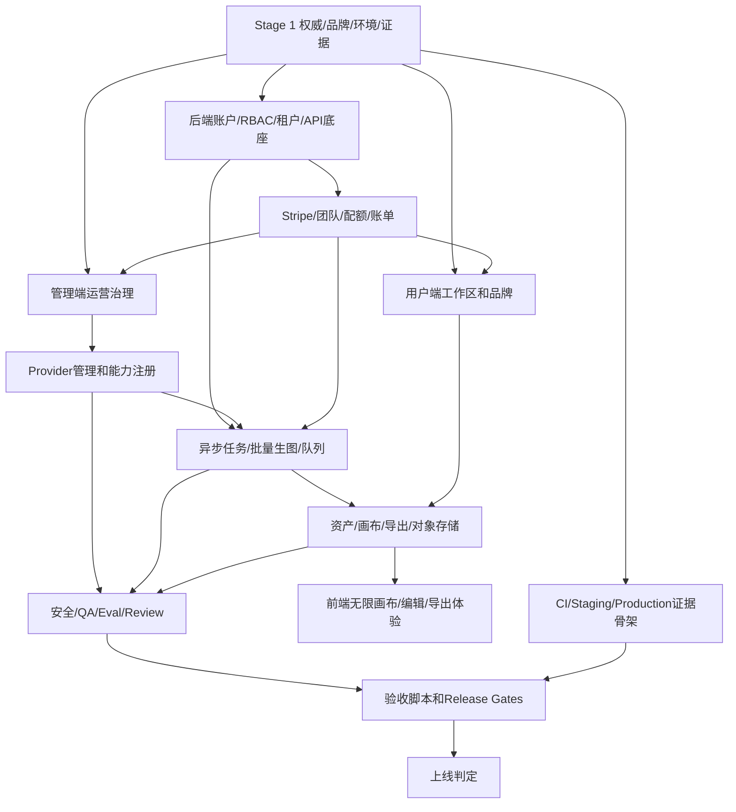

# zenari.ai Stage 1 上线工程蓝图

日期：2026-06-21  
状态：执行型蓝图  
语言：中文  
目标文件：`Docs/Stage1_20260621_blueprint.md`  
适用范围：把当前 Stage 0 Rev2 本地 alpha 工程推进为可私测、可付费、可观测、可回滚、可生产上线的 zenari.ai Web 产品。

## 0. 结论

Stage 1 不是 MVP，也不是只补一个“核心功能”。Stage 1 的目标是把上线工程一次性纳入同一张执行图：用户端 Web、管理端 Admin、后端 Backend API/runtime、provider 管理、异步并发批量生图、资产和画布、Stripe、团队、配额、QA、安全、可观测性、CI、staging、production、备份、回滚、事故响应、法律和支持。

Stage 1 的业务发布面固定为三端：用户端 Web、管理端 Admin、后端 Backend。CI/release metadata 的 release image 闭集只能是 `web`、`admin`、`backend`，不得新增 `manager`、`worker`、`crawler`、`migrate` 或任何第四类发布镜像。Worker、crawler、migrate 是 backend 镜像/二进制内的运行命令和进程形态，只能作为 backend runtime target / entrypoint / drain 证据出现，不作为独立 Docker image release blocker，也不作为独立业务内容面；`manager/` 是 legacy 本地 shell，不是独立上线业务面，也不作为 CI exact Docker、release metadata、Playwright 或 release gate 发布门槛。

执行纠偏：所有后续实现、Docker build、CI exact evidence、staging/prod deployment、security scan 和 release metadata 都必须按 `web`、`backend`、`admin` 三个业务单元归档。`worker`、`crawler`、`migrate` 只能证明 backend 镜像的 runtime entrypoint 可运行；`manager` 只能作为 source-only legacy local shell 说明存在，不允许出现在 docker-compose service、Dockerfile/build context、公网反代、CI exact Docker、release metadata 或 release gate blocker 中。任何把 manager 或 worker 当成独立业务内容、独立发布镜像、独立公网服务或默认 release gate blocker 的做法都视为 Stage 1 范围错误。

执行硬约束：

1. 公开品牌完整升级为 `zenari.ai`；历史代码包名、数据库名、OpenAPI 文件名可以保留兼容说明，但用户可见界面、legal、support、cookie/header、crawler UA、telemetry、Stripe checkout 展示和上线证据必须统一到 `zenari.ai`。
2. 用户端不管理 provider。provider、模型、成本、健康、密钥、路由、限流、kill switch、能力开关和真实供应商切换全部在 `admin/` 管理端完成；用户端只看到管理策略允许展示的模型/能力选项。
3. 通过对话批量做图必须走后端异步并发 fan-out：一次用户消息生成一个 batch request，再拆成多个 child task 并发调用 provider；并发数、重试、取消、配额、退款、trace、QA 和资产 lineage 都必须可审计。
4. Stripe 沙盒不是后续阻塞项。Stage 1 默认验证基线必须包含 `bash scripts/stripe_sandbox_selftest.sh`；本地 `.env` 可保存 Stripe test key，`.env.example` 只能保留占位符。
5. 每个 checklist item 的代码、测试、迁移、fixture、脚本和文档总量估算必须 `<= 2000 LOC`。超过上限时，先拆分再实现。
6. 上线门禁只能由 validator 可解析的精确证据关闭；README、草稿、目录存在、blocked probe 或口头描述不能关闭 CI、Staging、Production 或 Do-Not-Launch。
7. Release image / deploy artifact / security image scan / release metadata / production rollout 的业务闭集必须始终是 `web`、`admin`、`backend` 三个名字；worker/crawler/migrate 只能挂在 backend 证据下，manager 只能挂在 legacy local 说明下。

## 1. 权威边界

本文件是 Stage 1 上线工程的执行入口。它不替代 Stage 0 Rev2 的安全、合同和上线门禁，而是在 Stage 0 Rev2 之上扩展为完整上线工程。

输入权威源：

- `Docs/stage0_blueprint_rev2.md`：Stage 0 Rev2 上线定义、release gates、Do-Not-Launch、三端架构、用户端/管理端边界。
- `Docs/20260621_lovart_gap_blueprint.md`：对齐 Lovart 类 AI 设计工作区的能力 gap、画布、对象、工具、资产、Brand Kit、导出、Stripe、team 和验证路线。
- `README.md`：当前 launch-readiness snapshot。Local Alpha Gate 为 go；CI、Private Beta/Staging、Production Launch 和 Do-Not-Launch 仍为 no-go。
- `openapi/zenart.v1.yaml`：当前兼容性 API 合同路径；公开品牌是 `zenari.ai`。
- `.env.example`、`docker-compose.yml`、`scripts/stripe_sandbox_selftest.sh`、`scripts/repo_validate.sh`：当前环境变量、容器、Stripe 沙盒和 repo 验证基线。
- 当前仓库代码：`web/`、`admin/`、`backend/`、`scripts/`、`ops/`、`fixtures/`、`schemas/`。

输出权威物：

- 本文件的 DAG、checklist、release gates、停止/回滚/恢复条件。
- 后续执行时生成的精确证据文件，例如 `ops/evidence/ci/*.json`、`ops/evidence/staging/*.json`、`ops/evidence/production/*.json`。
- validator 脚本和 release gate fixture 的计算结果。

非权威物：

- README 中未被 fixture/validator 支撑的上线描述。
- `ops/ci/` draft workflow，除非真正安装到 `.github/workflows/` 并跑出精确 CI 证据。
- blocked probe、目录存在、截图单独存在、聊天记录、手工口头确认。

## 2. Stage 1 目标态

Stage 1 完成后，zenari.ai 应满足以下目标：

- 用户可以登录、创建项目、通过对话提交单图或批量图像任务，在无限画布查看并继续编辑结果。
- 对话批量做图可以并发异步调用多个 provider/model child task，支持进度流、局部失败、取消、重试、配额预留和失败退款。
- 画布对象是可持久化的真实对象：image、video、text、shape、frame、group、vector、generated layer 均有坐标、尺寸、层级、锁定、隐藏、版本、资产引用和 lineage。
- 管理端可以管理 provider/model routing、能力开关、成本、健康、并发、密钥引用、测试调用、kill switch、canary 和回滚。
- 后端提供 API、backend 内部 worker runtime、任务队列、provider adapter、billing/quota ledger、object storage、trace、QA、安全、审计、支持和导出闭环。
- Stripe test mode checkout、webhook、subscription、cancel、past_due、refund/credit、quota reset、team seat 和 invoice/receipt 显示有沙盒验收；生产启用时必须完成 live/test 分离和生产证据。
- staging 和 production 均有可观测性、告警、备份、恢复、回滚、事故响应、post-deploy smoke、法律和支持路径。
- Do-Not-Launch 只有在 Local Alpha、CI、Private Beta/Staging、Production Launch 四类 release gate fixture 全部计算为 `go` 后才能关闭。

## 3. 现在还缺什么

当前仓库已有 Stage 0 工程底座和 Stripe 沙盒 env/selftest，但距离 Stage 1 上线仍缺以下关键工程：

1. `zenari.ai` 品牌迁移未完成到所有用户可见、legal/support、cookie/header、crawler UA、telemetry、billing 和上线证据面。
2. CI installed workflow 缺真实 `.github/workflows/stage0-rev2-ci.yml` 和 PR/main、Playwright、Docker image build 精确运行证据。
3. Private Beta/Staging 仍缺 production-like object storage retention/cleanup 精确 staging 证据。
4. Production 仍缺 provider/claims、paid billing lifecycle、backup/restore、rollback/incident/post-deploy smoke 等精确 production 证据，并依赖 CI/Staging 先通过。
5. 用户端画布仍接近 bounded DOM workspace，不是可编辑、可缩放、可选择、可持久化、可导出的无限画布。
6. 通过对话批量做图还缺 batch request、child task fan-out、并发控制、进度流、局部失败、取消、重试、配额预留/退款和 trace。
7. provider 管理还需要在 `admin/` 做完整管理面：能力、密钥引用、成本、路由、健康、限流、kill switch、canary、回滚、测试调用。
8. 后端需要补真实 provider adapter、batch orchestration、provider usage cost ledger、model capability registry 和 provider health probing。
9. 资产库、Brand Kit、对象级版本、视觉导出、package/export 的真实文件资产链路仍需补齐。
10. Stripe 已拉通沙盒基础信息，但产品内 checkout/session、webhook 幂等、订阅状态、退款/credit、quota reset、团队席位和账单 UI 仍需上线级验收。
11. Auth、RBAC、tenant isolation、support、abuse、audit、safety、QA、eval、trace redaction 需要在 Stage 1 新能力上重新覆盖。
12. 法律、隐私、可接受使用、AI/content disclaimer、IP complaint、support SLA、refund policy、billing policy 需要按 paid launch 和 zenari.ai 品牌更新。

## 4. 系统分层

### 4.1 用户端 `web/`

用户端只做创作和账户体验：

- Chat workspace、prompt composer、batch progress、candidate/result grid。
- Infinite canvas、对象选择、移动、缩放、frame、text、shape、layers、asset placement。
- 对象级 AI 编辑入口：remove background、upscale、erase、expand、vectorize、mockup、edit text、split layers。
- Assets Library、Brand Kit picker、Skill template picker、export/package、billing/quota、team/account、support/report problem。
- 用户端不得暴露 provider key、成本、原始 routing、隐藏提示词、admin review 内部字段或 provider 管理面。

### 4.2 管理端 `admin/`

管理端负责所有运营和治理面：

- Provider/model/capability/routing/cost/health/secrets/kill switch/canary/rollback。
- Queue、task、batch、worker、quota、billing、usage、spend cap。
- Safety policy、Image QA、eval suite、review queue、activation gate、abuse hold。
- Support、audit、trace、export override、object storage retention、legal/support visibility evidence。
- 管理端必须以 RBAC 和 audit log 约束，每个可变更动作都有操作者、租户、原因和回滚目标。

### 4.3 后端 `backend/`

后端负责真实状态和副作用：

- Go API、backend 镜像内的 worker/crawler/migrate entrypoint、Postgres、Redis、object storage。
- Auth/session、RBAC、tenant isolation、audit、CSRF、rate limit、quota ledger。
- Batch generation orchestration、task queue、provider adapter、provider usage/cost、trace、redaction。
- Billing/Stripe checkout、webhook、subscription state、team/seat、refund/credit、quota reset。
- Asset lineage、canvas object persistence、export eligibility、package/export、signed URL、retention cleanup。

### 4.4 基础设施和证据

- Local：`docker compose up --build`，dev provider 可用，但不得伪装成真实生产生成。
- CI：安装 PR/main workflow，运行 web/admin/backend/test/build/security/docker/Playwright，并写精确 evidence。
- Staging：使用 production-like object storage、signed URL、retention cleanup、Stripe test checkout/webhook、provider sandbox、observability、backup、load 和 legal/support visibility。
- Production：live/test Stripe 分离、真实 provider 或明确 comp-only 模式、备份恢复、回滚、事故响应、post-deploy smoke、法律/支持/安全证据齐全。

## 5. 对话批量生图执行合同

该合同是 Stage 1 的关键能力，后续实现不得降级为前端循环调用 provider。

数据流：

1. 用户在 `web/` prompt composer 输入自然语言，可指定数量、比例、风格、Brand Kit、参考资产、选中画布对象和允许的模型偏好。
2. `backend/` 创建 `batch_generation_request`，记录 `project_id`、`workspace_id`、`tenant_id`、`prompt_context`、`requested_count`、`allowed_models`、`quota_reservation_id`、`trace_id`。
3. 后端按管理端策略生成多个 `generation_child_task`，每个 child task 锁定 provider/model/tool params、输入资产、seed、quota estimate 和 retry policy。
4. worker 从队列并发拉取 child task，并按 tenant/provider/model 三层并发限制执行。并发配置来自 Admin provider policy，不来自用户端。
5. 每个 child task 独立返回进度、成功资产、失败原因、安全/QA 结果、usage cost 和 trace projection。
6. batch request 聚合 child 状态：`queued`、`running`、`partial_succeeded`、`succeeded`、`failed`、`cancelled`、`blocked`。
7. 前端通过 polling 或 SSE 显示每张图的运行状态；成功结果直接落到画布和 assets library，失败结果可重试或退款。
8. 配额采用预留制：提交时按估算预留，成功按真实 usage commit，失败/取消按策略 refund，blocked task 不得吞额度。
9. trace 和 export 只暴露可见投影；provider key、隐藏 prompt、原始安全 payload 和内部路由不得进入用户端、导出包或 support ticket。

管理边界：

- Admin 管理 provider、模型、能力、成本、health、并发、限流、路由、canary、kill switch、secret reference。
- Web 只展示“自动”“推荐模型”“允许用户选择的模型/比例/质量”等策略投影。
- 后端是唯一真实调度方，所有 provider 调用必须经过 backend/worker 和 audit/trace/quota。

## 6. DAG



无环规则：任何任务只能依赖上游已验收能力或 Stage 0 已存在能力。发现循环依赖时，必须拆为合同、fixture、真实集成、上线证据四层。

## 7. Checklist 总览

本蓝图包含 128 个执行项：

- R：8 项，权威、品牌、环境、证据边界。
- FE：16 项，用户端工作区、无限画布、批量生图和导出体验。
- AD：14 项，管理端 provider、队列、运营、安全、支持和审计。
- BE：14 项，API、auth/RBAC、tenant、canvas、asset、trace 底座。
- WK：12 项，backend runtime 异步任务、batch fan-out、并发、取消、重试和进度；保留 `WK-*` 作为任务 ID 前缀，不能成为独立 worker 产品面或独立 Docker image。
- PR：10 项，provider adapter、能力、成本、健康、测试和切换。
- AS：12 项，资产库、对象存储、Brand Kit、导出和 retention。
- BL：11 项，Stripe、subscription、team、quota 和 billing evidence。
- QA：9 项，安全、QA、eval、review 和 redaction。
- OP：14 项，CI、staging、production、observability、backup、rollback、legal、support。
- VF：8 项，验证器、release gate、Do-Not-Launch 和最终验收。

每项默认规模上限：`<= 2000 LOC`，包括代码、测试、迁移、fixture、脚本和文档。实现前发现超限必须拆项，不得扩大单项范围。

## 8. 执行 Checklist

### R. 权威、品牌、环境、证据

| ID | 依赖 | 范围/路径 | 技术栈 | 落地实现点 | 验收证据 | 验证命令 | 规模 |
| --- | --- | --- | --- | --- | --- | --- | --- |
| R-1 | 无 | `Docs/Stage1_20260621_blueprint.md` | Markdown | 建立 Stage 1 权威边界、DAG、checklist、release gates、停止/回滚/恢复条件 | 本文件存在，含 128 项执行项和缺口清单 | `rg -n "Stage 1|DAG|Do-Not-Launch|缺什么" Docs/Stage1_20260621_blueprint.md` | <= 2000 LOC |
| R-2 | R-1 | `Docs/stage0_blueprint_rev2.md`, `README.md` | 文档审计 | 把 Stage 0 Local/CI/Staging/Production gate 状态映射到 Stage 1，不允许 README prose 关闭 gate | 文档列明当前 no-go 缺口和 exact evidence 要求 | `rg -n "CI Gate|Private Beta|Production Launch|Do-Not-Launch" Docs/Stage1_20260621_blueprint.md` | <= 2000 LOC |
| R-3 | R-1 | `.env`, `.env.example` | env | 本地 `.env` 保留 Stripe sandbox test key；`.env.example` 只保留 placeholder，不泄露真实 key | `.env.example` 没有真实 `sk_test`/`pk_test` 长 key，`.env` 被 gitignore | `git check-ignore .env`; `rg -n "sk_test_[A-Za-z0-9]{20,}|pk_test_[A-Za-z0-9]{20,}" .env.example && exit 1 || true` | <= 2000 LOC |
| R-4 | R-3 | `scripts/stripe_sandbox_selftest.sh`, `scripts/repo_validate.sh` | Bash, Stripe CLI | Stripe 沙盒自测纳入默认验证，检查 test mode、product、price、webhook secret 格式和 livemode=false | selftest 通过，repo_validate 覆盖该脚本 | `bash scripts/stripe_sandbox_selftest.sh`; `rg -n "stripe_sandbox_selftest" scripts/repo_validate.sh` | <= 2000 LOC |
| R-5 | R-1 | `.env.example`, `docker-compose.yml`, `web/`, `admin/`, `backend/`, `scripts/` | env, TS, Go | 公开品牌迁移到 `zenari.ai`，保留兼容性内部路径说明 | 用户可见文案/env/crawler/legal/support 统一，小写兼容性标识只在兼容路径出现 | `python3 scripts/validate_zenari_brand_migration.py web admin backend scripts .env.example docker-compose.yml` | <= 2000 LOC |
| R-6 | R-1 | `openapi/zenart.v1.yaml`, `web/lib/generated`, `admin/lib/generated` | OpenAPI | 标注 API 文件名为兼容性路径，公开 schema 文案和 generated client display name 迁到 zenari.ai | OpenAPI 公开产品名使用 `zenari.ai`，不再出现旧公开产品名 | `python3 scripts/validate_zenari_brand_migration.py openapi web/lib/generated admin/lib/generated` | <= 2000 LOC |
| R-7 | R-1 | `Docs/researches/stage1_gap_inventory.md` | Markdown | 建 Stage 1 gap inventory，列出前端、管理端、后端、Stripe、provider、ops 缺口和 owner | gap inventory 可追踪到本蓝图 ID | `rg -n "FE-|AD-|BE-|WK-|PR-|AS-|BL-|OP-" Docs/researches/stage1_gap_inventory.md` | <= 2000 LOC |
| R-8 | R-1 | `scripts/stage1_scope_guard.py` | Python | 校验 checklist 行项规模、依赖 ID、禁用词、精确证据路径和 placeholder secret 策略 | scope guard 可在 CI 调用 | `python3 scripts/stage1_scope_guard.py Docs/Stage1_20260621_blueprint.md` | <= 2000 LOC |

### FE. 用户端工作区、无限画布、批量生图体验

| ID | 依赖 | 范围/路径 | 技术栈 | 落地实现点 | 验收证据 | 验证命令 | 规模 |
| --- | --- | --- | --- | --- | --- | --- | --- |
| FE-1 | R-5 | `web/app`, `web/components` | Next.js, React | 用户端全局品牌、标题、nav、empty state、support/billing 文案迁到 zenari.ai | Playwright 截图和文案扫描通过 | `cd web && npm run typecheck`; `python3 scripts/validate_zenari_brand_migration.py web/app web/components` | <= 2000 LOC |
| FE-2 | BE-5 | `web/components/workspace` | React, TS | 把 workspace 状态接到真实 API/client 合同，减少 dev-state 私有字段漂移 | API smoke 和 typecheck 通过 | `cd web && npm run typecheck`; `cd web && npm run test -- api-client` | <= 2000 LOC |
| FE-3 | BE-6 | `web/components/canvas` | tldraw 或等价编辑器 | 无限画布 editor shell：pan、zoom、fit、select、drag，保留现有 workspace 入口 | 画布可拖拽缩放，旧 smoke 不回退 | `cd web && npm run smoke:workspace-rendering-performance` | <= 2000 LOC |
| FE-4 | FE-3 | `web/components/canvas/object-shapes.tsx` | React, Canvas/editor API | 渲染 image、video、text、shape、frame、group、vector、generated layer | 每类对象可显示、选择、移动 | `cd web && npm run test -- canvas`; `cd web && npx playwright test tests/stage1-canvas.spec.ts` | <= 2000 LOC |
| FE-5 | FE-4 | `web/components/canvas/toolbar.tsx` | React, lucide-react | 工具栏：select、hand、frame、text、shape、upload、undo、redo、zoom，图标按钮配 tooltip | UI 不挤压，不用 provider 管理入口 | `cd web && npm run typecheck`; Playwright 截图证据 | <= 2000 LOC |
| FE-6 | FE-4 | `web/components/canvas/layers-panel.tsx` | React | 图层面板：rename、hide、lock、z-index、frame membership | 图层操作和画布状态同步 | `cd web && npm run test -- layers` | <= 2000 LOC |
| FE-7 | FE-4 | `web/components/canvas/keyboard.ts` | TS | delete、duplicate、undo、redo、zoom、space hand、shift multi-select 快捷键 | 不影响输入框和可访问性 | `cd web && npm run test -- keyboard`; Playwright 用例 | <= 2000 LOC |
| FE-8 | WK-6 | `web/components/prompt-composer` | React, TS | Prompt composer 支持 selected object chips、数量、比例、reference、Brand Kit、允许的模型偏好 | payload 含 prompt context 和 batch 参数 | `cd web && npm run test -- prompt-composer` | <= 2000 LOC |
| FE-9 | FE-8 | `web/lib/mentions` | TS | `@object`、`@asset`、`@brand`、`@skill`、允许展示的 `@model` mention parser 和 picker | parser 单测覆盖中文、空格、重复 mention | `cd web && npm run test -- mentions` | <= 2000 LOC |
| FE-10 | WK-7 | `web/components/batch-progress` | React, polling/SSE | 批量生图进度面板：每个 child task 独立状态、缩略图、失败原因、retry/cancel | 局部成功和局部失败 UI 可用 | `cd web && npx playwright test tests/stage1-batch-generation.spec.ts` | <= 2000 LOC |
| FE-11 | WK-9, AS-3 | `web/components/canvas/result-placement.tsx` | React | 成功 child task 自动作为对象落到画布，并写入 assets library | 结果有 asset_id、object_id、trace_id | `cd web && npm run test -- result-placement` | <= 2000 LOC |
| FE-12 | QA-5 | `web/components/safety-review-state.tsx` | React | blocked/admin review/QA failed 状态清晰展示，不允许下载不合格资产 | blocked task 无 download/export CTA | `cd web && npx playwright test tests/stage1-safety-export.spec.ts` | <= 2000 LOC |
| FE-13 | AS-8 | `web/components/assets` | React | Assets Library picker：插入画布、加入 prompt、查看 lineage、跨项目复用限制 | tenant 隔离错误态可恢复 | `cd web && npm run test -- assets` | <= 2000 LOC |
| FE-14 | AS-9 | `web/components/brand-kit` | React | Brand Kit picker：logo、palette、font、guideline，支持项目默认和单次提及 | prompt context 带 brand_kit_id | `cd web && npm run test -- brand-kit` | <= 2000 LOC |
| FE-15 | BL-7 | `web/components/billing`, `web/app/billing` | React, Stripe.js | Billing/quota/team 页面：plan、checkout、subscription status、seat、quota ledger、invoice/receipt 链接 | Stripe test checkout 可从 UI 发起 | `cd web && npx playwright test tests/stage1-billing.spec.ts` | <= 2000 LOC |
| FE-16 | AS-11 | `web/components/export` | React, JSZip | Package/export 面板显示真实文件、manifest、QA、provenance、signed URL 和 blocked reason | 导出包不含 placeholder 伪资产 | `cd web && npm run smoke:package-export-metadata` | <= 2000 LOC |

### AD. 管理端运营、provider、治理和支持

| ID | 依赖 | 范围/路径 | 技术栈 | 落地实现点 | 验收证据 | 验证命令 | 规模 |
| --- | --- | --- | --- | --- | --- | --- | --- |
| AD-1 | R-5 | `admin/app`, `admin/components` | Next.js, React | 管理端品牌、标题、nav、登录态、support 链接迁到 zenari.ai | 文案扫描通过 | `cd admin && npm run typecheck`; `python3 scripts/validate_zenari_brand_migration.py admin/app admin/components` | <= 2000 LOC |
| AD-2 | BE-3 | `admin/lib/admin-auth.ts`, `backend/internal/auth` | TS, Go | 管理端独立 auth/session/RBAC enforcement，不复用普通用户权限 | 普通用户无法访问 `/api/admin/*` | `cd backend && go test ./internal/auth/... ./internal/security/...` | <= 2000 LOC |
| AD-3 | PR-2 | `admin/app/providers` | React, OpenAPI | Provider 列表：状态、能力、模型、成本、区域、延迟、错误率、spend cap、kill switch | 管理端可查看 provider 策略，不显示明文 secret | `cd admin && npm run test -- providers` | <= 2000 LOC |
| AD-4 | PR-3 | `admin/app/providers/[id]` | React | Provider 编辑：capability flags、model params、concurrency、routing weight、canary、fallback | 保存动作有 audit log | `cd admin && npm run test -- providers`; `cd backend && go test ./internal/audit/...` | <= 2000 LOC |
| AD-5 | PR-8 | `admin/app/providers/test-call` | React, Go API | Provider sandbox test call 面板，生成只写 staging/test evidence，不进入用户资产库 | 测试调用可审计且可清理 | `cd admin && npm run test -- provider-test-call` | <= 2000 LOC |
| AD-6 | WK-8 | `admin/app/queues`, `admin/app/operations` | React | Queue/batch dashboard：batch、child task、worker、tenant/provider/model 并发、retry、dead letter | 可定位卡住任务和取消原因 | `cd admin && npm run test -- queues` | <= 2000 LOC |
| AD-7 | BL-8 | `admin/app/quota`, `admin/app/billing` | React | Quota/billing ops：reservation、commit、refund、credit、subscription sync、seat usage | ledger 与 Stripe webhook 一致 | `cd admin && npm run test -- quota` | <= 2000 LOC |
| AD-8 | QA-3 | `admin/app/reviews`, `admin/app/safety` | React | Safety/QA review queue：blocked asset、policy reason、override eligibility、review action | reviewer 操作写 audit | `cd admin && npm run test -- reviews` | <= 2000 LOC |
| AD-9 | QA-7 | `admin/app/eval`, `admin/app/skills` | React | Eval suite 和 skill release/canary/rollback 管理，用户端只看审核后模板 | skill 上线需 eval pass | `cd admin && npm run validate` | <= 2000 LOC |
| AD-10 | AS-12 | `admin/app/exports` | React | Export override、retention、signed URL、blocked reason 和 regeneration 管理 | admin override 不绕过 audit | `cd admin && npm run test -- exports` | <= 2000 LOC |
| AD-11 | OP-8 | `admin/app/operations` | React | Observability dashboard links、alert state、release gate status、evidence links | 管理端可见当前 no-go/gate 状态 | `cd admin && npm run test -- operations` | <= 2000 LOC |
| AD-12 | OP-12 | `admin/app/support` | React | Support/abuse/admin deletion 管理，支持关联 trace、export、billing、asset，但不泄露 secret | support ticket redaction 测试通过 | `cd admin && npm run test -- support`; `cd backend && go test ./internal/security/...` | <= 2000 LOC |
| AD-13 | BE-4 | `admin/app/audit`, `backend/internal/audit` | React, Go | Audit log 搜索、过滤、导出，覆盖 provider、billing、review、support、rollback 动作 | audit immutable 验证通过 | `cd backend && go test ./internal/audit/...`; `cd admin && npm run test -- audit` | <= 2000 LOC |
| AD-14 | VF-6 | `admin/app/release` | React | Release readiness 面板读取 fixture/evidence 状态，不允许人工按钮直接标 go | 面板只能显示 validator 结果 | `cd admin && npm run test -- release` | <= 2000 LOC |

### BE. 后端 API、账户、合同和持久化底座

| ID | 依赖 | 范围/路径 | 技术栈 | 落地实现点 | 验收证据 | 验证命令 | 规模 |
| --- | --- | --- | --- | --- | --- | --- | --- |
| BE-1 | R-1 | `backend/internal/config` | Go | Stage 1 config 扩展：brand、Stripe、provider、batch、queue、object storage、observability 必填/默认规则 | config tests 覆盖 test/live 分离和 placeholder 拒绝 | `cd backend && go test ./internal/config` | <= 2000 LOC |
| BE-2 | R-3 | `backend/internal/security` | Go | Secret classification/redaction 覆盖 Stripe、provider、object storage、incident、support、export、trace | 日志和 API 不泄露 key | `cd backend && go test ./internal/security/...` | <= 2000 LOC |
| BE-3 | R-1 | `backend/internal/auth`, `backend/internal/rbac` | Go | 用户 auth 与 admin auth 分离，session refresh、logout、expired-session、role enforcement | `/api/admin/*` 普通用户拒绝 | `cd backend && go test ./internal/auth/... ./internal/rbac/...` | <= 2000 LOC |
| BE-4 | BE-3 | `backend/internal/audit` | Go, Postgres | audit 覆盖 provider、billing、quota、asset、review、support、rollback、release gate 动作 | audit 不可变，检索可用 | `cd backend && go test ./internal/audit/...` | <= 2000 LOC |
| BE-5 | R-6 | `openapi/zenart.v1.yaml`, `web/lib/generated`, `admin/lib/generated` | OpenAPI, TS | Stage 1 API 合同生成：batch、canvas object、provider admin、billing、brand kit、asset lineage | generated client 无漂移 | `python3 scripts/generate_openapi_clients.py`; `cd web && npm run typecheck`; `cd admin && npm run typecheck` | <= 2000 LOC |
| BE-6 | BE-5 | `backend/internal/canvas` | Go | CanvasObject 模型：type、transform、z-index、frame、lock、hidden、asset_ref、lineage_ref | Go/TS/OpenAPI 字段一致 | `cd backend && go test ./internal/canvas/...` | <= 2000 LOC |
| BE-7 | BE-6 | `backend/migrations`, `backend/internal/store` | SQL, Go | Canvas object/version/frame/group 持久化迁移，兼容旧 workspace 数据 | migration tests 和 rollback notes | `cd backend && go test ./internal/store/... ./internal/canvas/...` | <= 2000 LOC |
| BE-8 | BE-5 | `backend/internal/assets` | Go | VisualAsset 模型：storage_ref、thumbnail_ref、source_ref、lineage、tenant、status、QA/export flags | 资产可查、可隔离、可追溯 | `cd backend && go test ./internal/assets/...` | <= 2000 LOC |
| BE-9 | BE-8 | `backend/internal/assets/tenant_test.go` | Go | 资产、画布对象、export、signed URL 跨租户隔离测试 | 其他租户 asset_id 不可读 | `cd backend && go test ./internal/assets/... ./internal/stage0/...` | <= 2000 LOC |
| BE-10 | BE-5 | `backend/internal/agent`, `backend/internal/trace` | Go | PromptContextPayload 和 TraceProjection：text、selected objects、assets、brand、model hints、tool hint | trace completeness validator 通过 | `python3 scripts/validate_trace_completeness.py`; `cd backend && go test ./internal/trace/...` | <= 2000 LOC |
| BE-11 | BE-10 | `backend/internal/security`, `backend/internal/trace` | Go | trace 可见投影和红线字段：provider payload、hidden prompt、raw safety、secret 永不出用户端/export | trace visibility validator 通过 | `python3 scripts/validate_trace_visibility_export_retention.py` | <= 2000 LOC |
| BE-12 | BE-5 | `backend/internal/support` | Go | support ticket 关联 project/task/batch/asset/export/billing，自动 redaction | ticket 可用于排障但不泄露 secret | `cd backend && go test ./internal/support/... ./internal/security/...` | <= 2000 LOC |
| BE-13 | BE-5 | `backend/internal/ratelimit` | Go, Redis | 用户、tenant、provider、admin action 的 rate limit 和 spend cap enforcement | 超限返回可解释错误并写 audit | `cd backend && go test ./internal/ratelimit/...` | <= 2000 LOC |
| BE-14 | BE-5 | `backend/internal/api` | Go | API error contract：retryable、blocked、quota_insufficient、provider_unavailable、review_required | 前端可稳定处理错误态 | `cd backend && go test ./internal/api/...`; `cd web && npm run test -- api-client` | <= 2000 LOC |

### WK. Backend runtime 异步任务、batch fan-out 和并发

本节的 `WK-*` 是 backend 内部 runtime 能力编号，不是第四个业务端。相关代码可以落在 `backend/cmd/worker` 和 `backend/internal/worker`，但 Docker、CI、staging、production 和 release metadata 都只能把它归入 backend 发布单元。

| ID | 依赖 | 范围/路径 | 技术栈 | 落地实现点 | 验收证据 | 验证命令 | 规模 |
| --- | --- | --- | --- | --- | --- | --- | --- |
| WK-1 | BE-5 | `backend/internal/task`, `backend/migrations` | Go, SQL | BatchGenerationRequest 和 GenerationChildTask 数据模型、状态机和迁移 | 状态机单测覆盖 queued/running/partial/failed/cancelled/blocked | `cd backend && go test ./internal/task/...` | <= 2000 LOC |
| WK-2 | WK-1 | `openapi/zenart.v1.yaml` | OpenAPI | API：create batch、get batch、list child tasks、cancel batch、retry child task、progress endpoint | generated client 可用 | `python3 scripts/generate_openapi_clients.py`; `cd backend && go test ./internal/api/...` | <= 2000 LOC |
| WK-3 | WK-1, PR-2 | `backend/internal/worker/scheduler.go` | Go, Redis/Postgres | Fan-out scheduler 按 admin provider policy 拆 child task，不在前端循环调用 | 单次 prompt 生成多个 child task | `cd backend && go test ./internal/worker/...` | <= 2000 LOC |
| WK-4 | WK-3 | `backend/internal/worker/concurrency.go` | Go, Redis | tenant/provider/model/global 四层并发限制，支持 burst 和公平调度 | 并发测试证明不超限 | `cd backend && go test ./internal/worker/... -run Concurrency` | <= 2000 LOC |
| WK-5 | WK-3 | `backend/internal/worker/retry.go` | Go | retry policy、exponential backoff、dead letter、provider retryable/non-retryable 分类 | retry 不重复扣费，不丢 trace | `cd backend && go test ./internal/worker/... -run Retry` | <= 2000 LOC |
| WK-6 | BL-5, WK-1 | `backend/internal/billing`, `backend/internal/task` | Go | Batch quota reservation：预估预留、child commit、失败/取消 refund、blocked 不吞额度 | billing/quota tests 通过 | `cd backend && go test ./internal/billing/... ./internal/task/...` | <= 2000 LOC |
| WK-7 | WK-2 | `backend/internal/api/progress` | Go, SSE 或 polling | Batch progress endpoint，返回 batch 和 child 状态、缩略图、可重试动作 | 前端可实时显示局部结果 | `cd backend && go test ./internal/api/...`; Playwright 用例 | <= 2000 LOC |
| WK-8 | WK-2 | `backend/internal/task/cancel.go` | Go | Cancel batch/child task：未开始任务取消，运行中发 provider cancel if supported，最终退款策略一致 | 取消后状态和 ledger 一致 | `cd backend && go test ./internal/task/... -run Cancel` | <= 2000 LOC |
| WK-9 | WK-3, PR-5 | `backend/internal/worker/result.go` | Go | Child success 写 VisualAsset、CanvasObject、thumbnail、lineage、trace projection | 成功结果自动可画布引用 | `cd backend && go test ./internal/worker/... ./internal/assets/...` | <= 2000 LOC |
| WK-10 | WK-3, QA-2 | `backend/internal/worker/safety_gate.go` | Go | Provider request 前后 safety/QA gate，blocked task 不落可下载资产 | blocked 有 review reason | `python3 scripts/validate_safety_enforcement_contract.py`; `cd backend && go test ./internal/worker/...` | <= 2000 LOC |
| WK-11 | WK-3 | `backend/cmd/worker`, `docker-compose.yml` | Go, Docker | Worker graceful drain、claim timeout、idempotency key、startup config check；worker 作为 backend runtime entrypoint 运行，不能成为独立 release image | 重启不重复执行已完成 child，且证据挂在 backend runtime 下 | `cd backend && go test ./cmd/worker ./internal/worker/...` | <= 2000 LOC |
| WK-12 | WK-1 | `fixtures/stage1/batch_generation` | JSON, scripts | Stage 1 batch generation fixtures：single、4 variants、20 variants、partial failure、cancel、quota insufficient | fixtures 可由 validator 回放 | `python3 scripts/validate_stage1_batch_generation_contract.py` | <= 2000 LOC |

### PR. Provider 管理、adapter、能力和成本

| ID | 依赖 | 范围/路径 | 技术栈 | 落地实现点 | 验收证据 | 验证命令 | 规模 |
| --- | --- | --- | --- | --- | --- | --- | --- |
| PR-1 | BE-5 | `backend/internal/provider` | Go | ProviderCapability schema：image/video/edit/upscale/remove-bg/batch/seed/aspect/quality/cancel/cost | schema 与 Admin UI 对齐 | `cd backend && go test ./internal/provider/...` | <= 2000 LOC |
| PR-2 | PR-1 | `backend/internal/provider/registry.go`, `backend/migrations` | Go, SQL | Provider registry 持久化：provider、model、capability、routing、cost、health、secret_ref | Admin 可 CRUD，secret 不明文返回 | `cd backend && go test ./internal/provider/... ./internal/security/...` | <= 2000 LOC |
| PR-3 | PR-2 | `backend/internal/provider/routing.go` | Go | Routing policy：tenant plan、tool type、capability、cost、health、canary、fallback、kill switch | 路由可解释且写 trace | `cd backend && go test ./internal/provider/... -run Routing` | <= 2000 LOC |
| PR-4 | PR-2 | `backend/internal/provider/adapters/dev` | Go | Dev provider 保留 deterministic fixtures，明确标记 non-production | dev 结果不被生产证据误用 | `cd backend && go test ./internal/provider/...` | <= 2000 LOC |
| PR-5 | PR-2 | `backend/internal/provider/adapters/image` | Go | 至少一个真实或 sandbox image provider adapter：generate image、batch、status、usage、error mapping | staging provider sandbox evidence | `cd backend && go test ./internal/provider/...`; staging smoke | <= 2000 LOC |
| PR-6 | PR-2 | `backend/internal/provider/adapters/edit` | Go | 编辑类 adapter 合同：remove background、upscale、erase、expand、mask input、result asset | edit tools fixture 和 adapter tests | `cd backend && go test ./internal/provider/... ./internal/edittools/...` | <= 2000 LOC |
| PR-7 | PR-2 | `backend/internal/provider/adapters/video` | Go | Video provider adapter 合同：duration、aspect、first/last frame、status polling、storage result | video sandbox fixture 可回放 | `cd backend && go test ./internal/provider/... -run Video` | <= 2000 LOC |
| PR-8 | PR-2 | `backend/internal/provider/health.go` | Go | Health probing：latency、error rate、quota exhaustion、auth failure、model disabled | Admin status 与 alert 指标一致 | `cd backend && go test ./internal/provider/... -run Health` | <= 2000 LOC |
| PR-9 | PR-2, BL-5 | `backend/internal/provider/usage.go` | Go | Provider usage/cost ledger：task_id、provider、model、units、estimated/actual cost、currency | usage 与 quota/billing 可对账 | `cd backend && go test ./internal/provider/... ./internal/billing/...` | <= 2000 LOC |
| PR-10 | PR-2 | `ops/evidence/staging/provider-sandbox.json` | JSON, smoke scripts | Staging provider sandbox 证据：test mode、非 live 生产误用、可生成/可失败/可取消 | 证据可由 validator 验证 | `python3 scripts/validate_stage1_provider_sandbox_evidence.py` | <= 2000 LOC |

### AS. 资产、画布、Brand Kit、导出和对象存储

| ID | 依赖 | 范围/路径 | 技术栈 | 落地实现点 | 验收证据 | 验证命令 | 规模 |
| --- | --- | --- | --- | --- | --- | --- | --- |
| AS-1 | BE-8 | `backend/internal/objectstore` | Go, S3-compatible | Object storage ref 统一：original、thumbnail、derived、export、qa report、manifest | ref 不含 credential/query/fragment | `cd backend && go test ./internal/objectstore/...`; security scan | <= 2000 LOC |
| AS-2 | AS-1 | `backend/internal/assets/thumbnail.go` | Go | Thumbnail pipeline：上传、provider result、video poster、failed placeholder 禁止当成成品 | thumbnail 和原资产分离 | `cd backend && go test ./internal/assets/... -run Thumbnail` | <= 2000 LOC |
| AS-3 | BE-8 | `backend/internal/assets/lineage.go` | Go | Asset lineage：original、derived_from、tool、provider、prompt_context、task、created_by | 编辑和导出可追溯 | `cd backend && go test ./internal/assets/... -run Lineage` | <= 2000 LOC |
| AS-4 | BE-6, AS-3 | `backend/internal/canvas/version.go` | Go | 对象级 version history、workspace version、恢复和冲突处理 | 恢复对象不丢其他对象 | `cd backend && go test ./internal/canvas/... -run Version` | <= 2000 LOC |
| AS-5 | FE-4, AS-4 | `web/components/canvas/version-history.tsx` | React | 前端对象级版本预览、恢复、差异标记 | Playwright 恢复用例通过 | `cd web && npx playwright test tests/stage1-canvas-version.spec.ts` | <= 2000 LOC |
| AS-6 | BE-8 | `backend/internal/edittools` | Go | 编辑工具合同：crop/rotate/flip 非破坏性 metadata，AI 编辑生成新资产 revision | 原始资产保留 | `cd backend && go test ./internal/edittools/...` | <= 2000 LOC |
| AS-7 | FE-4, PR-6 | `web/components/edit-tools` | React, Canvas 2D | 局部 mask/lasso/brush/rect 编辑 UI，输出 mask asset 和 tool params | mask 与源图尺寸对齐 | `cd web && npm run test -- edit-tools`; Playwright 用例 | <= 2000 LOC |
| AS-8 | BE-8 | `backend/internal/assets/library.go`, `web/components/assets` | Go, React | Assets Library：跨项目复用、插入画布、加入 prompt、收藏、归档、tenant 隔离 | tenant isolation tests 通过 | `cd backend && go test ./internal/assets/...`; `cd web && npm run test -- assets` | <= 2000 LOC |
| AS-9 | BE-8 | `backend/internal/brandkit`, `web/components/brand-kit` | Go, React | Brand Kit：logo、palette、font、guidelines、brand book parse result、项目默认 | prompt context 可引用 Brand Kit | `cd backend && go test ./internal/brandkit/...`; `cd web && npm run test -- brand-kit` | <= 2000 LOC |
| AS-10 | AS-1 | `backend/internal/export` | Go, JSZip/browser | Export manifest：files、qa、safety、provenance、trace projection、license/disclaimer | manifest 不缺关键字段 | `python3 scripts/validate_export_eligibility_decision_contract.py` | <= 2000 LOC |
| AS-11 | AS-10, BE-6, AS-3 | `backend/internal/export/render.go` | Go | 真实视觉导出：PNG/SVG/ZIP，PSD 先输出 layer manifest，不把 metadata 当成成品 | export ZIP 包含真实文件 | `python3 scripts/validate_workflow_export_zip_evidence_contract.py`; web smoke | <= 2000 LOC |
| AS-12 | AS-1 | `scripts/staging_object_storage_retention_cleanup_smoke.sh`, `ops/evidence/staging/object-storage-retention-cleanup.json` | Bash, JSON | Staging object retention/cleanup 精确证据：retention policy、expired export cleanup、orphan cleanup、audit refs | Private Beta/Staging storage blocker 可被 validator 关闭 | `scripts/staging_object_storage_retention_cleanup_smoke.sh`; `python3 scripts/validate_stage0_rev2.py` | <= 2000 LOC |

### BL. Stripe、团队、配额和账单

| ID | 依赖 | 范围/路径 | 技术栈 | 落地实现点 | 验收证据 | 验证命令 | 规模 |
| --- | --- | --- | --- | --- | --- | --- | --- |
| BL-1 | R-4 | `.env`, `.env.example`, `backend/internal/config` | env, Go | Stripe test env 读取、placeholder 拒绝、live/test 分离、webhook secret 校验 | config tests 和 sandbox selftest 通过 | `bash scripts/stripe_sandbox_selftest.sh`; `cd backend && go test ./internal/config` | <= 2000 LOC |
| BL-2 | BL-1 | `backend/internal/billing/stripe_checkout.go` | Go, Stripe API | Checkout session 创建：price、success/cancel URL、tenant/user metadata、idempotency key | Stripe test checkout session 可创建 | `cd backend && go test ./internal/billing/...`; staging billing smoke | <= 2000 LOC |
| BL-3 | BL-1 | `backend/internal/billing/stripe_webhook.go` | Go | Webhook 验签、幂等、event store、subscription/customer/invoice/payment_failed 状态同步 | 重放 webhook 不重复变更 | `cd backend && go test ./internal/billing/... -run Webhook` | <= 2000 LOC |
| BL-4 | BL-3 | `backend/internal/billing/subscription.go` | Go | Subscription lifecycle：active、trialing、past_due、cancelled、incomplete、cancel at period end | 账户状态和 UI 一致 | `cd backend && go test ./internal/billing/... -run Subscription` | <= 2000 LOC |
| BL-5 | BL-4 | `backend/internal/billing/quota.go` | Go, Postgres | Quota ledger：reservation、commit、refund、credit、reset、provider usage link、export link | ledger 不可负，幂等 | `cd backend && go test ./internal/billing/...` | <= 2000 LOC |
| BL-6 | BL-4 | `backend/internal/team` | Go, SQL | Team/seat：owner/member、invite、seat billing、concurrency entitlement、member removal | seat 变化写 audit | `cd backend && go test ./internal/team/... ./internal/audit/...` | <= 2000 LOC |
| BL-7 | BL-2, BL-4, BL-5 | `backend/internal/api/billing.go`, `web/lib/billing-client.ts` | Go, TS | Billing API/client：checkout、portal 或取消入口、subscription state、quota display、invoice links | 前端可稳定调用 billing API | `cd backend && go test ./internal/api/... ./internal/billing/...`; `cd web && npm run test -- billing-client` | <= 2000 LOC |
| BL-8 | BL-5 | `backend/internal/api/admin_billing.go`, `backend/internal/billing/admin_ops.go` | Go | 管理端 billing ops API：manual credit、refund note、sync subscription、lock account | 操作写 audit 且有权限控制 | `cd backend && go test ./internal/api/... ./internal/billing/... ./internal/audit/...` | <= 2000 LOC |
| BL-9 | BL-3 | `ops/evidence/staging/stripe-test-checkout-webhook.json` | JSON, smoke scripts | Staging Stripe test checkout + webhook evidence：livemode=false、checkout、paid、past_due、cancel、refund/credit | staging billing gate 可验证 | `python3 scripts/validate_stage1_stripe_staging_evidence.py` | <= 2000 LOC |
| BL-10 | BL-4 | `ops/evidence/production/billing-lifecycle.json` | JSON | Production billing lifecycle evidence：live/test separation、paid flow、refund/credit、webhook idempotency | Production billing blocker 可关闭 | `python3 scripts/validate_stage0_rev2.py` | <= 2000 LOC |
| BL-11 | BL-5, PR-9 | `backend/internal/billing/provider_cost_reconcile.go` | Go | Provider cost 与 quota/billing reconciliation：usage outlier、spend cap、invoice period report | 成本异常告警可用 | `cd backend && go test ./internal/billing/... ./internal/provider/...` | <= 2000 LOC |

### QA. 安全、QA、Eval、Review 和 Redaction

| ID | 依赖 | 范围/路径 | 技术栈 | 落地实现点 | 验收证据 | 验证命令 | 规模 |
| --- | --- | --- | --- | --- | --- | --- | --- |
| QA-1 | BE-10 | `schemas/stage1/safety_policy.schema.json`, `backend/internal/safety` | JSON Schema, Go | Stage 1 safety policy 覆盖 prompt、reference、provider request、provider result、export、support | schema 和 runtime 合同通过 | `python3 scripts/validate_safety_enforcement_contract.py`; backend tests | <= 2000 LOC |
| QA-2 | QA-1 | `backend/internal/safety/enforce.go` | Go | 安全 enforcement 接入 batch child task、edit tool、asset import、export eligibility | blocked 不落可下载资产 | `cd backend && go test ./internal/safety/... ./internal/worker/...` | <= 2000 LOC |
| QA-3 | AS-3 | `backend/internal/qa` | Go | Image QA：resolution、format、watermark/unsafe marker、placeholder detection、export readiness | QA result 关联 asset 和 export | `python3 scripts/validate_qa_result_contract.py`; backend tests | <= 2000 LOC |
| QA-4 | QA-3 | `backend/internal/export` | Go | Export gate：QA failed、safety blocked、missing provenance、missing manifest 时 fail closed | 不合格资产不能下载 | `python3 scripts/validate_export_eligibility_decision_contract.py` | <= 2000 LOC |
| QA-5 | QA-2, AD-8 | `backend/internal/review` | Go | Admin review：require_admin_review、override eligibility、reviewer role、decision audit | override 不绕过红线 | `python3 scripts/validate_export_override_contract.py`; backend tests | <= 2000 LOC |
| QA-6 | PR-5 | `fixtures/stage1/eval`, `backend/internal/eval` | Go, JSON | Eval suites：batch generation、provider routing、edit tools、export、billing/quota、safety | eval results 可存储和读取 | `python3 scripts/run_stage0_eval.py`; eval validators | <= 2000 LOC |
| QA-7 | QA-6 | `backend/internal/skillbook`, `backend/internal/eval` | Go | 用户可见 skill template 只发布 review/eval/canary 通过版本 | 用户端不暴露内部 prompt fragment 管理 | `cd backend && go test ./internal/skillbook/... ./internal/eval/...` | <= 2000 LOC |
| QA-8 | BE-11 | `scripts/security_scan_smoke.sh`, `backend/internal/security` | Bash, Go | Secret/redaction/security scan 覆盖新 provider、Stripe、batch、assets、support、export | security smoke 通过 | `scripts/security_scan_smoke.sh`; backend security tests | <= 2000 LOC |
| QA-9 | WK-12 | `ops/evidence/staging/stage1-safety-qa-eval.json` | JSON, scripts | Staging safety/QA/eval evidence 覆盖批量生图、编辑工具、导出和 admin review | staging gate 可引用精确文件 | `python3 scripts/validate_stage1_safety_qa_evidence.py` | <= 2000 LOC |

### OP. CI、Staging、Production、观测、备份、法律和支持

| ID | 依赖 | 范围/路径 | 技术栈 | 落地实现点 | 验收证据 | 验证命令 | 规模 |
| --- | --- | --- | --- | --- | --- | --- | --- |
| OP-1 | R-8 | `.github/workflows/stage0-rev2-ci.yml` | GitHub Actions | 安装 PR/main CI workflow，覆盖 Stage 0 + Stage 1 baseline：web/admin/backend/test/build/security/docker/stripe selftest | `.github/workflows` 文件存在且运行 | `test -f .github/workflows/stage0-rev2-ci.yml`; `python3 scripts/validate_stage0_rev2.py` | <= 2000 LOC |
| OP-2 | OP-1 | `ops/evidence/ci/stage0-rev2-pr-main-run.json` | JSON | CI PR/main run 精确证据：environment=ci、release_gate_check_id、passing status、无 preserved blocker | CI runtime blocker 可关闭一部分 | `python3 scripts/validate_stage0_rev2.py` | <= 2000 LOC |
| OP-3 | OP-1 | `ops/evidence/ci/stage0-rev2-playwright-smoke.json` | JSON | CI Playwright smoke 精确证据，覆盖用户端、管理端、billing、workspace smoke；batch/canvas 深功能由 Stage 1 feature/staging validators 证明 | Playwright 证据 validator 可解析 | `python3 scripts/validate_stage0_rev2.py` | <= 2000 LOC |
| OP-4 | OP-1 | `ops/evidence/ci/stage0-rev2-docker-image-build.json` | JSON | CI Docker image build 精确证据：release image 闭集必须严格等于 web/admin/backend image build pass；backend image 覆盖 server/worker/crawler/migrate runtime/build proof；禁止 manager/worker/crawler/migrate 作为独立 release image | CI Docker blocker 可关闭 | `python3 scripts/validate_stage0_rev2.py` | <= 2000 LOC |
| OP-5 | AS-12 | `ops/evidence/staging/object-storage-retention-cleanup.json` | JSON | Staging object storage retention/cleanup canonical pass evidence | Private Beta/Staging storage gate 可关闭 | `python3 scripts/validate_stage0_rev2.py` | <= 2000 LOC |
| OP-6 | BL-9, PR-10 | `ops/evidence/staging/stage1-runtime.json` | JSON | Staging runtime evidence 聚合：auth/RBAC、batch、provider sandbox、Stripe test、object storage、observability、backup、load、support、safety、legal | staging aggregate 可判断 | `python3 scripts/validate_stage1_staging_runtime.py` | <= 2000 LOC |
| OP-7 | WK-12 | `scripts/load_smoke.sh`, `ops/evidence/staging/stage1-load.json` | Bash, JSON | Load smoke 覆盖 20 variants batch、queue contention、provider fallback、export、billing webhook | p95、错误率和队列延迟可测 | `scripts/load_smoke.sh`; load evidence validator | <= 2000 LOC |
| OP-8 | BE-10, WK-7 | `ops/observability` | OTEL, metrics, dashboards | 指标和告警：batch duration、child failure、provider error、queue delay、quota refund、Stripe webhook、export block | dashboard/alerts 导入 staging | `scripts/observability_smoke.sh` | <= 2000 LOC |
| OP-9 | AS-1 | `scripts/backup_restore_drill.sh`, `ops/evidence/staging/stage1-backup-restore.json` | Bash, JSON | Staging backup/restore drill 覆盖 Postgres、object storage、asset lineage、billing ledger | RPO/RTO 记录齐全 | `scripts/backup_restore_drill.sh`; evidence validator | <= 2000 LOC |
| OP-10 | OP-9 | `ops/evidence/production/backup-restore.json` | JSON | Production backup/restore 精确证据：schedule、Postgres restore、object restore、RPO/RTO、audit refs | Production backup split row 可关闭 | `python3 scripts/validate_stage0_rev2.py` | <= 2000 LOC |
| OP-11 | OP-10 | `ops/evidence/production/rollback-incident-post-deploy-smoke.json` | JSON | Production rollback、incident path、migration compatibility、post-deploy smoke 精确证据，引用 CI/Staging go；worker drain/`runtime-worker` 回滚只能作为 backend release image 的 runtime target 证据 | Production rollback split row 可关闭 | `python3 scripts/validate_stage0_rev2.py` | <= 2000 LOC |
| OP-12 | R-5 | `web/lib/legal-policies.ts`, `admin/app/support`, `ops/evidence/staging` | TS, JSON | Legal/support 更新：Terms、Privacy、Acceptable Use、AI/content、IP complaint、refund、billing、support SLA | staging 外部用户可见证据 | `scripts/staging_legal_support_visibility_smoke.sh` | <= 2000 LOC |
| OP-13 | QA-8 | `ops/evidence/production/security-launch-checks.json` | JSON | Production security launch checks：secret scan、RBAC、CSRF、CSP、rate limit、provider key containment、Stripe live/test separation | security production row 可关闭 | `python3 scripts/validate_stage0_rev2.py` | <= 2000 LOC |
| OP-14 | BL-10, PR-10, OP-11 | `ops/release`, `README.md` | Markdown, JSON | Release notes 和 README snapshot 更新，只反映 fixture 计算结果，不提前声称上线 ready | README 与 release fixture 一致 | `python3 scripts/render_no_go_release_notes.py --check`; `python3 scripts/validate_stage0_rev2.py` | <= 2000 LOC |

### VF. 验证器、Release Gates 和最终上线判定

| ID | 依赖 | 范围/路径 | 技术栈 | 落地实现点 | 验收证据 | 验证命令 | 规模 |
| --- | --- | --- | --- | --- | --- | --- | --- |
| VF-1 | R-8 | `scripts/validate_stage1_blueprint.py` | Python | 验证本蓝图 checklist ID、依赖存在、规模标注、禁用词、关键章节、Stripe selftest 引用 | 文档自检通过 | `python3 scripts/validate_stage1_blueprint.py Docs/Stage1_20260621_blueprint.md` | <= 2000 LOC |
| VF-2 | WK-12 | `scripts/validate_stage1_batch_generation_contract.py` | Python | 验证 batch/child 状态机、quota reservation/refund、trace、progress 和 fixture | batch 合同可自动验收 | `python3 scripts/validate_stage1_batch_generation_contract.py` | <= 2000 LOC |
| VF-3 | PR-10 | `scripts/validate_stage1_provider_sandbox_evidence.py` | Python | 验证 provider sandbox evidence：test mode、health、generate、cancel、failure、usage/cost | provider staging 证据可验 | `python3 scripts/validate_stage1_provider_sandbox_evidence.py` | <= 2000 LOC |
| VF-4 | BL-9 | `scripts/validate_stage1_stripe_staging_evidence.py` | Python | 验证 Stripe test checkout/webhook evidence：livemode=false、checkout、subscription、refund、idempotency | billing staging 证据可验 | `python3 scripts/validate_stage1_stripe_staging_evidence.py` | <= 2000 LOC |
| VF-5 | QA-9 | `scripts/validate_stage1_safety_qa_evidence.py` | Python | 验证 batch/edit/export 的 safety、QA、review、override 和 blocked export 证据 | 安全证据不可绕过 | `python3 scripts/validate_stage1_safety_qa_evidence.py` | <= 2000 LOC |
| VF-6 | OP-6 | `scripts/validate_stage1_staging_runtime.py` | Python | 聚合 staging runtime：auth、RBAC、batch、provider、Stripe、object storage、observability、backup、load、legal/support | staging readiness 只由 exact evidence 计算 | `python3 scripts/validate_stage1_staging_runtime.py` | <= 2000 LOC |
| VF-7 | OP-14 | `scripts/validate_stage1_production_launch.py` | Python | 聚合 production launch：provider/claims、paid lifecycle、backup/rollback、security、legal/support、CI/Staging dependency | production readiness 只由 exact evidence 计算 | `python3 scripts/validate_stage1_production_launch.py` | <= 2000 LOC |
| VF-8 | VF-1, VF-6, VF-7 | `scripts/repo_validate.sh`, `fixtures/stage0/rev2/*.json` | Bash, Python | repo_validate 纳入 Stage 1 验证器，并保持 Stage 0 release gate validator 继续生效 | 全仓验证通过且 Do-Not-Launch 全 false 后才能上线 | `bash scripts/repo_validate.sh`; `python3 scripts/validate_stage0_rev2.py` | <= 2000 LOC |

## 9. Release Gates

### 9.1 Local Alpha Gate

Local Alpha 可以继续使用 dev provider 和 local object storage，但必须满足：

- `docker compose up --build` 可启动 backend、worker、crawler、Postgres、Redis、local object storage；`docker compose --profile frontend up --build` 可启动 web/admin。worker/crawler 必须共用 backend image，不能成为独立 release image；manager 不得作为 compose service、Docker image 或公网服务参与默认 compose/release gate。
- Stage 0 workflow smoke、export ZIP、QA、安全、trace、quota、support 仍通过。
- Stage 1 新增的 canvas、batch generation、provider registry、Stripe sandbox selftest 在本地可跑通 fixture。
- Dev provider 结果必须明确标记为 non-production，不得进入生产上线证据。

### 9.2 CI Gate

CI Gate 只有在以下 exact evidence 都通过时才可关闭：

- `.github/workflows/stage0-rev2-ci.yml` 已安装并包含 Stage 0 和 Stage 1 验证。
- `ops/evidence/ci/stage0-rev2-pr-main-run.json`。
- `ops/evidence/ci/stage0-rev2-playwright-smoke.json`。
- `ops/evidence/ci/stage0-rev2-docker-image-build.json`，且 release image 集合必须严格等于 `web`、`admin`、`backend`；worker/crawler/migrate 只能作为 backend runtime/build proof，manager 不得出现；security image scan 和 release metadata 也只能引用这三个 release image。
- CI 必须运行 `bash scripts/stripe_sandbox_selftest.sh`，并在无真实 secret 泄露的前提下证明 Stripe test mode 可用。

### 9.3 Private Beta / Staging Gate

Staging Gate 必须满足：

- 真实 auth、admin auth、RBAC、tenant isolation、audit。
- production-like object storage、signed URL、retention cleanup、orphan cleanup、audit refs。
- Batch generation staging evidence：并发 fan-out、局部失败、取消、重试、quota reservation/refund。
- Provider sandbox evidence：至少一个 sandbox/real test provider 可 generate、失败、取消、记录 usage/cost。
- Stripe test checkout/webhook evidence：livemode=false、checkout、subscription、past_due/cancel、refund/credit、webhook idempotency。
- Safety/QA/eval/review/export gate evidence 覆盖新增能力。
- Observability、backup/restore、load、post-deploy smoke、legal/support external-user visibility。

### 9.4 Production Launch Gate

Production Launch 必须满足：

- CI Gate 和 Private Beta/Staging Gate fixture 均计算为 `go`。
- Production rollout 的业务部署单元只能是 web/admin/backend；worker/crawler/migrate 的 drain、重启、回滚证据必须归属于 backend runtime，manager 不得成为 production deploy artifact。
- 如果对外声称真实生成，至少一个 real production provider 完成合同化接入、监控、成本记录、staging verification 和 production evidence。
- 如果不接真实生产 provider，只能明确 invite/comp-only，并隐藏付费/真实生成相关声明。
- 如果启用付费，Stripe live/test 分离、paid checkout、subscription、cancel、past_due、refund/credit、quota reset、webhook idempotency、team seat 和 invoice/receipt 均有 production evidence。
- Production backup/restore、rollback/incident/post-deploy smoke exact evidence 存在并通过。
- 安全、隐私、法律、支持、abuse、incident runbook、dashboard、alert、SLO、release notes、known risks 全部完成。

### 9.5 Do-Not-Launch

以下任一条件存在时，不得上线：

- 任一 release gate fixture 的 `gate_decision.status` 仍为 `no_go`。
- CI exact runtime evidence 缺失。
- Staging object storage retention/cleanup exact evidence 缺失。
- Production backup/restore 或 rollback/incident/post-deploy smoke exact evidence 缺失。
- Production paid billing lifecycle、provider/claims、security、legal/support 证据缺失。
- 用户端可访问 provider 管理、secret、隐藏 prompt、内部 routing 或未授权 admin 数据。
- Batch generation 会吞额度、重复扣费、丢 trace、绕过 QA、安全或 tenant isolation。
- 导出包包含 placeholder、无 manifest、无 provenance、无 QA/safety 投影或未授权 signed URL。

## 10. 停止、回滚、恢复条件

停止条件：

- 任何实现项估算超过 `2000 LOC` 且未拆分。
- 检测到 secret 泄露到 `.env.example`、日志、trace、export、support ticket 或前端 bundle。
- 用户端暴露 provider 管理、provider key、内部 routing、隐藏 prompt 或 admin-only 字段。
- Quota ledger 出现负数、重复扣费、失败不退款或 webhook 重放造成重复状态变更。
- Batch child task 可跨租户读取 asset、canvas object、export 或 signed URL。
- Staging/production evidence 用目录、README、blocked probe 或 draft 关闭 release gate。

回滚条件：

- Provider error rate、queue delay、Stripe webhook failure、quota mismatch、export blocked spike、safety critical block、object storage error 超过阈值。
- 新迁移破坏旧 workspace/canvas/export 读取。
- 新 batch scheduler 导致 worker 重启后重复执行已完成 child task。
- 用户端 canvas 性能明显低于 Stage 0 workspace rendering smoke 阈值。

恢复条件：

- 回滚后保留 audit、trace、quota ledger 和 support evidence。
- 修复必须补充失败复现 fixture、回归测试和 validator 规则。
- 恢复上线前重新运行本文件 Stage 1 baseline、Stage 0 validator、Stripe sandbox selftest、CI/Staging/Production 对应 smoke。

## 11. 默认验证基线

本地和 CI 至少运行：

```bash
bash scripts/stripe_sandbox_selftest.sh
docker compose --env-file .env.example config --quiet
cd backend && go test ./...
cd web && npm run typecheck
cd web && npm run test
cd admin && npm run typecheck
cd admin && npm run test
python3 scripts/validate_stage0_rev2.py
bash scripts/repo_validate.sh
```

Stage 1 新增 validator 完成后追加：

```bash
python3 scripts/validate_stage1_blueprint.py Docs/Stage1_20260621_blueprint.md
python3 scripts/validate_stage1_batch_generation_contract.py
python3 scripts/validate_stage1_provider_sandbox_evidence.py
python3 scripts/validate_stage1_stripe_staging_evidence.py
python3 scripts/validate_stage1_safety_qa_evidence.py
python3 scripts/validate_stage1_staging_runtime.py
python3 scripts/validate_stage1_production_launch.py
```

## 12. 最终验收

Stage 1 只能在以下条件全部满足时宣布完成：

1. 本文件 128 个 checklist item 全部完成或被更小 item 替代，且每项都有代码、测试、证据和验证命令。
2. `bash scripts/stripe_sandbox_selftest.sh` 默认通过，且 `.env.example` 无真实 Stripe key。
3. 前端、管理端、后端全部通过 typecheck/test/build/smoke。
4. Release image、security scan、release metadata 和 production rollout 都只包含 `web`、`admin`、`backend` 三类业务发布单元；worker/crawler/migrate 只作为 backend runtime 证据，manager 只作为 source-only legacy local shell 说明，不得有 Docker image、compose service 或公网反代入口。
5. Batch generation 以 backend/worker 异步并发 fan-out 实现，不存在前端直接 provider loop。
6. Provider 管理只存在于 Admin，用户端没有 provider 管理和 secret 暴露。
7. Stage 0 validator 仍通过，Local Alpha、CI、Private Beta/Staging、Production Launch release gate fixture 全部计算为 `go`。
8. Do-Not-Launch Conditions 全部为 false。
9. README launch-readiness snapshot 与 validator 结果一致，没有提前声称上线就绪。
